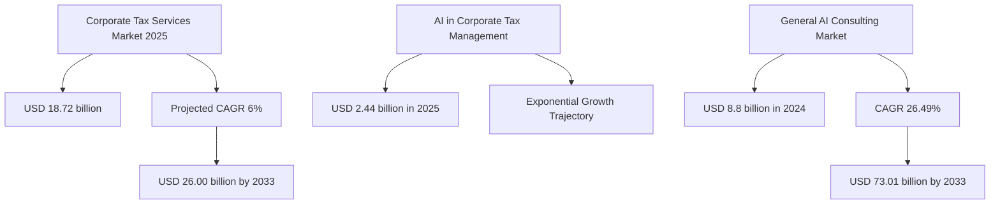
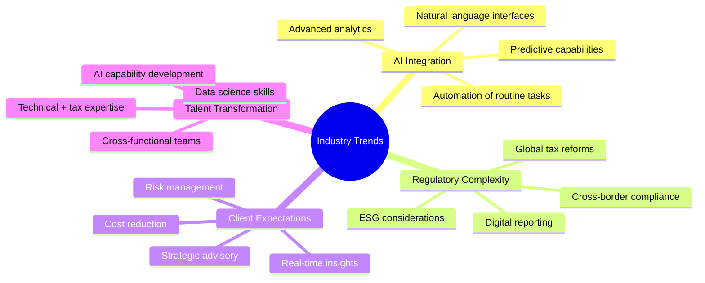
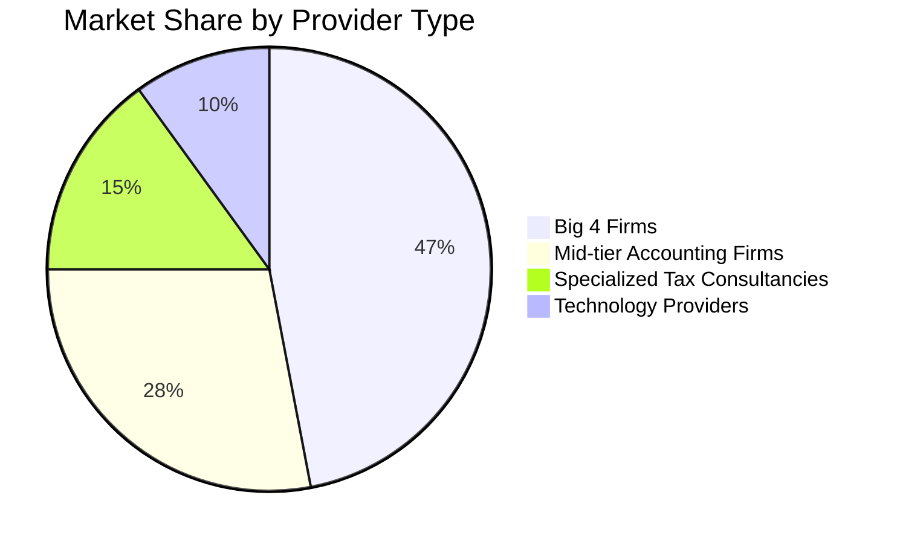
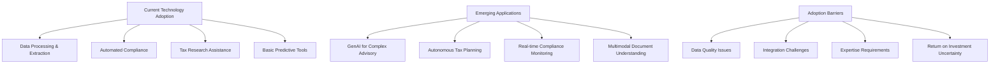
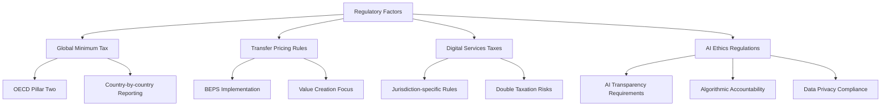

# Market Research

## Industry Overview

This section explores the current state and future projections of the corporate tax consulting industry, with a specific focus on AI integration opportunities.

## Table of Contents
- [Market Size & Growth](#market-size--growth)
- [Industry Trends](#industry-trends)
- [Competitive Landscape](#competitive-landscape)
- [Technology Adoption](#technology-adoption)
- [Regulatory Environment](#regulatory-environment)

## Market Size & Growth

The corporate tax consulting market represents a significant opportunity:

The generative AI segment in corporate tax management is experiencing particularly rapid growth, increasing from $1.86 billion in 2024 to $2.44 billion in 2025, representing a substantial growth opportunity for specialized providers.

## Industry Trends

Key trends reshaping corporate tax consulting:

## Competitive Landscape

### Market Segmentation

### Key Players & Capabilities

| Category | Examples | AI Integration Level | Key Strengths | Limitations |
|----------|----------|---------------------|---------------|-------------|
| Big 4 | PwC, EY, KPMG, Deloitte | High | Global reach, reputation, resources | Legacy systems, high costs |
| Mid-tier | BDO, RSM, Grant Thornton | Medium | Regional expertise, personalized service | Limited AI capabilities |
| Specialist Tax | Ryan, Avalara | Medium-High | Domain expertise, focused solutions | Narrower service scope |
| Technology | Thomson Reuters, Wolters Kluwer | High | Advanced technology, scalable platforms | Less tax advisory depth |
| New Entrants | AI-first startups | Very High | Cutting-edge technology, agility | Limited market presence |

## Technology Adoption

Current state of AI adoption in tax consulting:

### AI Capability Maturity Model

| Stage | Description | Current Market Penetration | Example Applications |
|-------|-------------|----------------------------|----------------------|
| 1. Basic Automation | Rule-based processes, document digitization | 80% | OCR for document processing, template-based reporting |
| 2. Advanced Analytics | Pattern recognition, anomaly detection | 45% | Variance analysis, audit risk scoring |
| 3. Predictive Capabilities | Forward-looking insights based on historical data | 25% | Tax liability forecasting, scenario planning |
| 4. Generative AI Integration | NLP-powered assistance, content generation | 15% | Tax memo drafting, regulation interpretation |
| 5. Autonomous Agents | Self-directed AI handling complex processes | <5% | Continuous compliance monitoring, automated advisory |

## Regulatory Environment

Key regulatory factors influencing AI-powered tax consulting:

