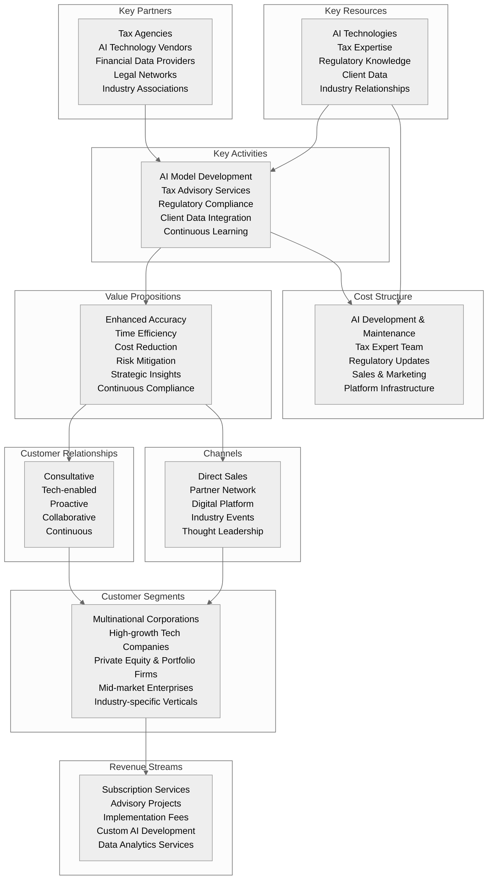
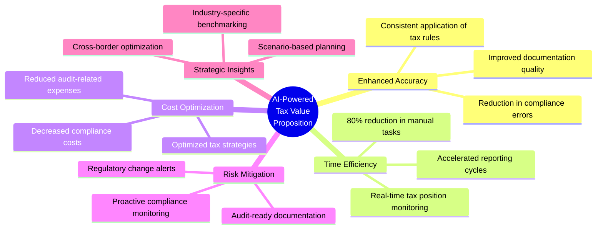
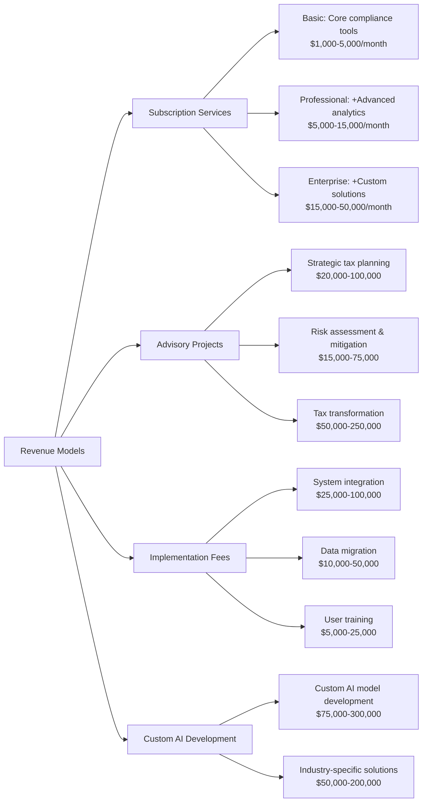
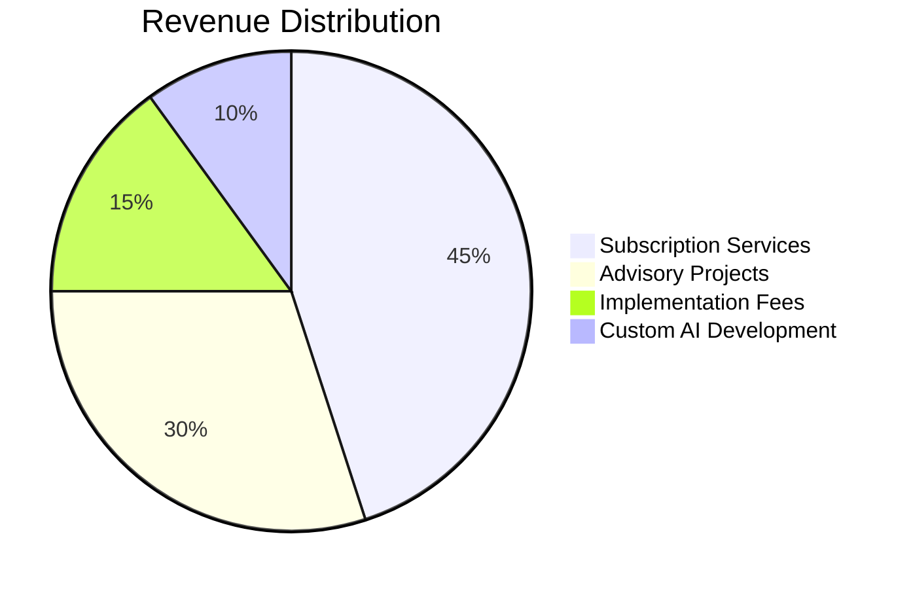
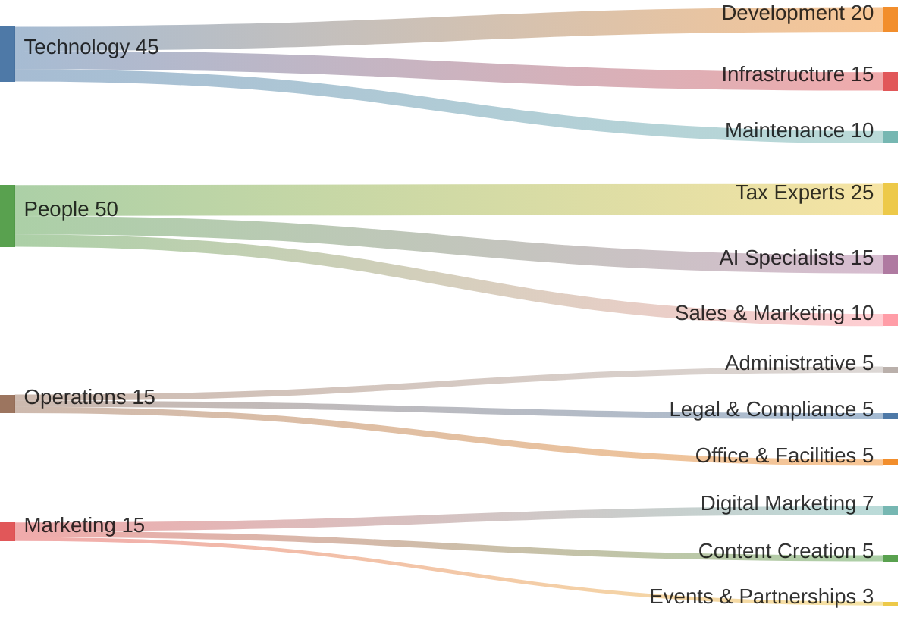

# Business Analysis

This section provides a comprehensive analysis of the business model, value proposition, and strategic positioning for our AI-powered corporate tax consulting venture.

## Table of Contents
- [Business Model Canvas](#business-model-canvas)
- [Value Proposition](#value-proposition)
- [SWOT Analysis](#swot-analysis)
- [Revenue Models](#revenue-models)
- [Cost Structure](#cost-structure)
- [Key Success Factors](#key-success-factors)

## Business Model Canvas



## Value Proposition

Our differentiated value proposition leverages the intersection of AI capabilities and tax expertise:



## SWOT Analysis

```mermaid
quadrant-chart
    title SWOT Analysis
    x-axis Helpful to Harmful
    y-axis Internal to External
    quadrant-1 Strengths
    quadrant-2 Weaknesses
    quadrant-3 Threats
    quadrant-4 Opportunities
    "Cutting-edge AI technology": [0.15, 0.2]
    "Tax expertise integration": [0.25, 0.25]
    "Scalable delivery model": [0.2, 0.15]
    "Data-driven insights": [0.25, 0.3]
    "Initial brand recognition": [0.7, 0.2]
    "High development costs": [0.75, 0.25]
    "Talent acquisition challenges": [0.8, 0.3]
    "Data integration complexity": [0.7, 0.15]
    "Rapid regulatory changes": [0.75, 0.75]
    "Competitive tech adoption": [0.65, 0.8]
    "Security & privacy concerns": [0.8, 0.7]
    "Growing market demand": [0.2, 0.7]
    "Underserved mid-market": [0.15, 0.8]
    "Regulatory complexity increase": [0.25, 0.75]
    "Cross-border tax opportunities": [0.3, 0.7]
```

### Detailed SWOT Analysis

#### Strengths
- **Cutting-edge AI technology**: Proprietary models trained specifically for tax applications
- **Tax expertise integration**: Combined technical and domain expertise
- **Scalable delivery model**: Ability to serve clients of various sizes with consistent quality
- **Data-driven insights**: Capability to extract meaningful patterns from complex tax data

#### Weaknesses
- **Initial brand recognition**: Building trust in a new solution against established players
- **High development costs**: Significant investment needed for AI model development
- **Talent acquisition challenges**: Difficulty finding individuals with combined AI and tax expertise
- **Data integration complexity**: Need to work with diverse client systems and data formats

#### Opportunities
- **Growing market demand**: Increasing interest in AI-powered tax solutions
- **Underserved mid-market**: Gap between expensive Big 4 services and basic software solutions
- **Regulatory complexity increase**: Growing need for sophisticated compliance solutions
- **Cross-border tax opportunities**: Rising multinational operations requiring specialized guidance

#### Threats
- **Rapid regulatory changes**: Tax laws evolving faster than AI models can adapt
- **Competitive tech adoption**: Established firms investing heavily in similar technologies
- **Security & privacy concerns**: Client hesitation about AI handling sensitive tax data

## Revenue Models



### Revenue Breakdown Projection (Year 3)



## Cost Structure



## Key Success Factors

```mermaid
graph TD
    A[Key Success Factors] --> B[Technical Excellence]
    A --> C[Domain Authority]
    A --> D[Client Experience]
    A --> E[Talent Strategy]
    A --> F[Operational Efficiency]
    
    B --> B1[Advanced AI models]
    B --> B2[Integration capabilities]
    B --> B3[Data security framework]
    
    C --> C1[Tax expertise credibility]
    C --> C2[Regulatory relationships]
    C --> C3[Thought leadership]
    
    D --> D1[Intuitive interfaces]
    D --> D2[Personalized service]
    D --> D3[Continuous improvement]
    
    E --> E1[Unique talent blend]
    E --> E2[Training & development]
    E --> E3[Collaborative culture]
    
    F --> F1[Scalable processes]
    F --> F2[Performance metrics]
    F --> F3[Knowledge management]
```


