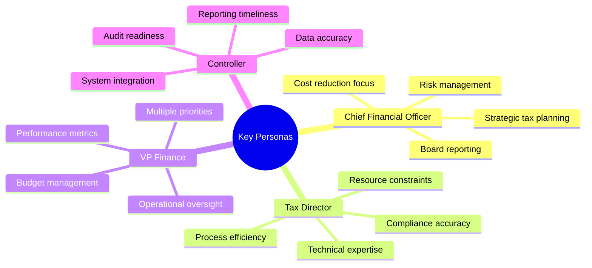
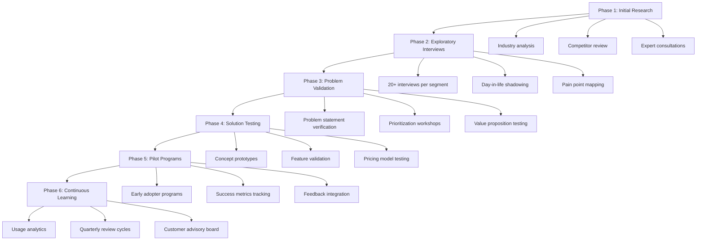
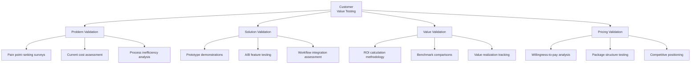

# Customer Discovery Strategy

This section outlines our approach to identifying, understanding, and validating our target customers' needs and pain points in corporate tax management.

## Table of Contents
- [Target Market Segments](#target-market-segments)
- [Customer Personas](#customer-personas)
- [Discovery Process](#discovery-process)
- [Pain Points & Needs Analysis](#pain-points--needs-analysis)
- [Value Testing Framework](#value-testing-framework)

## Target Market Segments

We've identified the following primary market segments for our AI-powered tax consulting services:

```mermaid
graph TD
    A[Target Market Segments] --> B[Enterprise Multinationals]
    A --> C[High-Growth Scale-ups]
    A --> D[Mid-Market Companies]
    A --> E[Private Equity Portfolio]
    A --> F[Industry Verticals]
    
    B --> B1[Revenue: $1B+]
    B --> B2[Complex multi-jurisdiction]
    B --> B3[Tax dept: 15+ people]
    
    C --> C1[Revenue: $50M-$500M]
    C --> C2[Rapid expansion phase]
    C --> C3[Limited tax resources]
    
    D --> D1[Revenue: $100M-$1B]
    D --> D2[Regional operations]
    D --> D3[Tax dept: 3-10 people]
    
    E --> E1[PE-backed companies]
    E --> E2[Transition/transformation]
    E --> E3[Reporting requirements]
    
    F --> F1[Technology]
    F --> F2[Financial Services]
    F --> F3[Healthcare]
    F --> F4[Manufacturing]
```



## Customer Personas

### Primary Decision Makers



### Detailed Persona Profiles

#### Enterprise Tax Director

| Attribute | Description |
|-----------|-------------|
| **Demographics** | Age: 45-55, MBA/CPA, 15+ years experience |
| **Goals** | Ensure compliance, minimize tax burden, streamline processes |
| **Challenges** | Resource limitations, growing complexity, technology integration |
| **Current Solutions** | Big 4 partnerships, legacy tax software, internal teams |
| **Decision Factors** | ROI, risk reduction, integration capability, credibility |
| **Information Sources** | Professional networks, industry conferences, thought leadership |

#### Scale-up CFO

| Attribute | Description |
|-----------|-------------|
| **Demographics** | Age: 35-45, Finance background, growth-focused |
| **Goals** | Support rapid growth, establish scalable processes, maximize cash flow |
| **Challenges** | Limited tax expertise, changing requirements, competing priorities |
| **Current Solutions** | Outsourced services, basic automation tools, external advisors |
| **Decision Factors** | Scalability, time savings, cost efficiency, growth support |
| **Information Sources** | Peer recommendations, digital content, investor network |

## Discovery Process

Our structured approach to deeply understanding customer needs:



## Pain Points & Needs Analysis

```mermaid
quadrant-chart
    title Tax Function Pain Points: Severity vs. Addressability
    x-axis Low Impact to High Impact
    y-axis Hard to Address to Easy to Address
    quadrant-1 Strategic Focus
    quadrant-2 Quick Wins
    quadrant-3 Deprioritize
    quadrant-4 Complex Initiatives
    "Manual data processing": [0.75, 0.85]
    "Error-prone tax calculations": [0.85, 0.75]
    "Slow reporting cycles": [0.7, 0.8]
    "Fragmented systems": [0.8, 0.5]
    "Limited strategic insights": [0.9, 0.4]
    "Regulatory change management": [0.85, 0.35]
    "Documentation inconsistency": [0.65, 0.7]
    "Audit preparation burden": [0.7, 0.65]
    "Cross-border complexity": [0.9, 0.25]
    "Talent/resource constraints": [0.75, 0.45]
```

### Key Customer Pain Points by Segment

| Market Segment | Primary Pain Points | Current Workarounds | Impact on Business |
|----------------|---------------------|---------------------|-------------------|
| **Enterprise** | - Regulatory complexity<br>- Cross-border compliance<br>- Siloed data systems | - Large tax departments<br>- Multiple consulting partners<br>- Custom-built systems | - High compliance costs<br>- Inefficient processes<br>- Missed tax planning opportunities |
| **Scale-ups** | - Rapidly changing requirements<br>- Limited tax expertise<br>- Cash flow optimization | - Outsourced tax function<br>- Reactive approach<br>- Basic automation tools | - Tax surprises<br>- Growth constraints<br>- Inefficient tax structure |
| **Mid-Market** | - Resource constraints<br>- Technology limitations<br>- Balancing cost vs. quality | - Hybrid internal/external model<br>- Underinvestment in technology<br>- Manual processes | - Compliance risks<br>- Inefficient tax spend<br>- Lack of strategic focus |

## Value Testing Framework

Our methodology for validating that our solution addresses real customer needs:



### Customer Validation Metrics

| Validation Area | Key Metrics | Target Thresholds | Measurement Methods |
|-----------------|-------------|-------------------|---------------------|
| **Problem** | Pain point severity score<br>Current solution satisfaction<br>Process time assessment | 8+/10 severity<br><6/10 satisfaction<br>20+ hours/week | Surveys<br>Interviews<br>Process mapping |
| **Solution** | Feature relevance score<br>Usability assessment<br>Integration capability | 8+/10 relevance<br>Task success rate >85%<br>Integration feasibility >7/10 | Prototype testing<br>User tasks<br>IT assessment |
| **Value** | Projected time savings<br>Error reduction potential<br>Strategic insight value | 50%+ time reduction<br>80%+ error reduction<br>$100K+ value potential | ROI calculator<br>Error analysis<br>Value workshopping |
| **Pricing** | Price sensitivity metrics<br>Value/price ratio<br>Competitive positioning | Van Westendorp optimal price point<br>Value/price ratio >3:1<br>Favorable comparison to alternatives | Pricing survey<br>Value perception testing<br>Competitive analysis |
