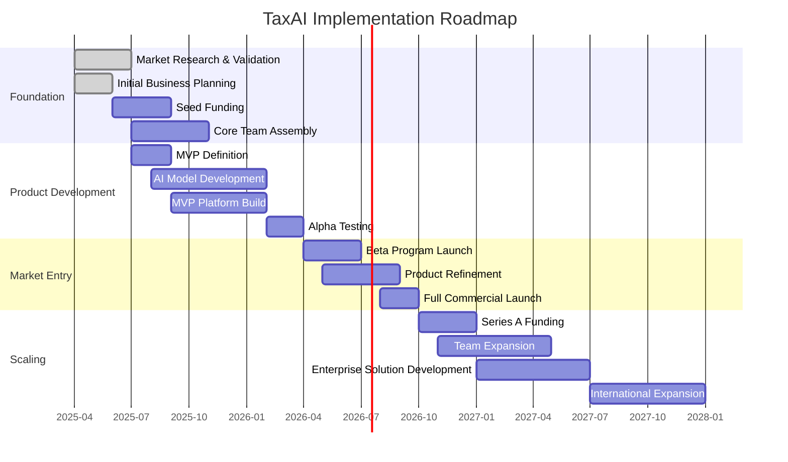
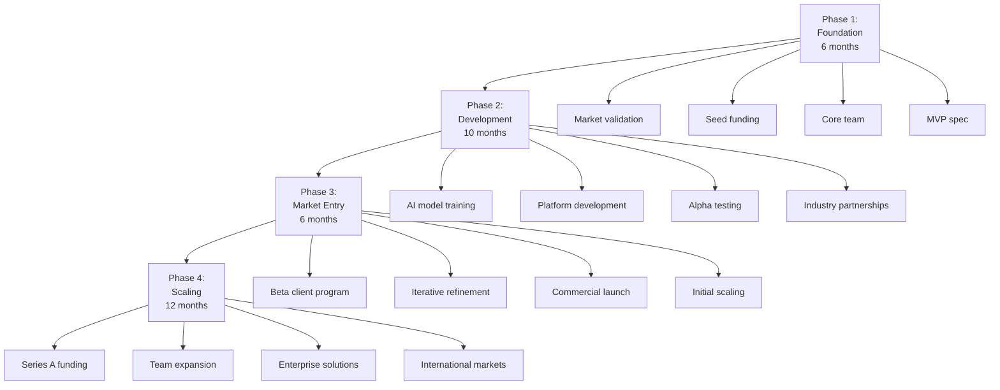
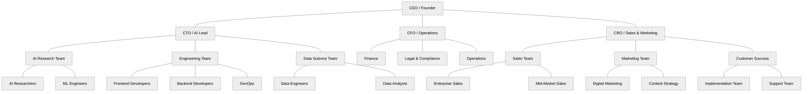
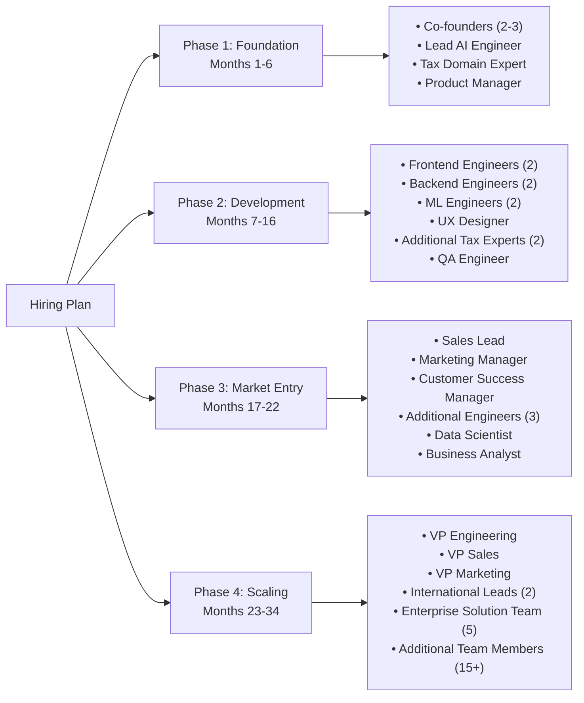
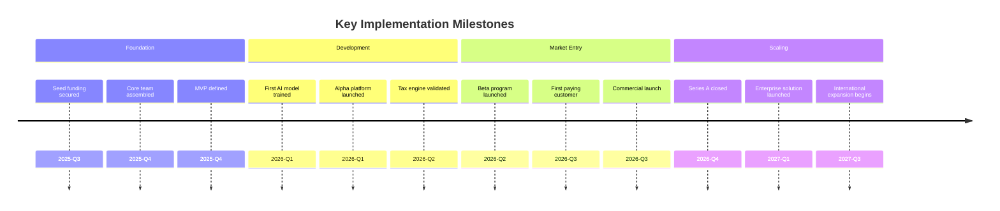
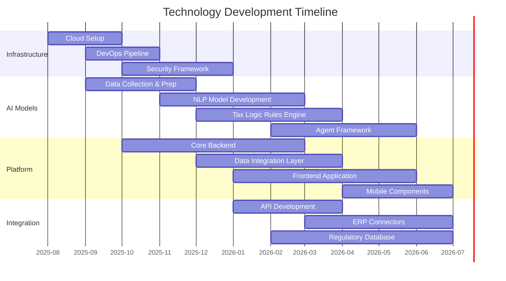

# 🛠️ Implementation Plan

*Building TaxFlo from concept to market leader in 34 months*

<b>📗 Table of Contents</b>

- [🌐 Strategic Roadmap](#-strategic-roadmap)
- [💡 Phased Approach](#-phased-approach)
- [👥 Team Structure](#-team-structure)
- [🌟 Key Milestones](#-key-milestones)
- [💻 Technology Implementation](#-technology-implementation)
- [⚠️ Risk Management](#%EF%B8%8F-risk-management)

## 🌐 Strategic Roadmap

> "A comprehensive implementation strategy bridges vision and execution."

The high-level strategic implementation roadmap:

## 💡 Phased Approach

> "Our deliberate, phased approach minimizes risk while validating core assumptions at each stage."

Our implementation follows a deliberate, phased approach to mitigate risks and validate assumptions:

### Phase Details

| Phase | Timeframe | Key Objectives | Success Criteria | Resource Requirements |
|-------|-----------|----------------|------------------|----------------------|
| **Foundation** | Months 1-6 | • Validate market assumptions • Secure seed funding • Assemble core team • Define MVP specifications | • $1-2M seed capital raised • Core team of 5-7 members • 10+ customer validation interviews • Clear MVP definition | • Founding team (3-4 people) • Advisory board • Initial capital ($250-500K) |
| **Development** | Months 7-16 | • Develop core AI models • Build initial platform • Alpha test with friendly users • Establish key partnerships | • Working MVP with core features • Successful alpha testing • 3-5 industry partnerships • Technical validation | • Technical team (5-7 people) • Domain experts (2-3 people) • Development resources ($750K-1M) |
| **Market Entry** | Months 17-22 | • Launch beta program • Refine based on feedback • Full commercial launch • Initial client acquisition | • 10-15 beta clients • 85%+ satisfaction rate • 5-10 paying clients • Positive testimonials | • Full team (12-15 people) • Marketing resources ($300-500K) • Sales capacity (2-3 people) |
| **Scaling** | Months 23-34 | • Raise Series A • Expand team • Develop enterprise solutions • Enter international markets | • $5-10M Series A raised • Team growth to 30-40 people • 30+ active clients • Entry into 2-3 new markets | • Expanded team (30-40 people) • International resources • Growth capital ($5-10M) |

## 👥 Team Structure

> "Building the right team with the perfect blend of tax expertise and technical innovation."

The organizational structure will evolve through implementation phases:

### Hiring Plan

## 🌟 Key Milestones

> "Clear milestones provide measurable targets to track progress and celebrate success."

Critical milestones for measuring implementation progress and success:

## 💻 Technology Implementation

> "Our technology stack forms the foundation for scalable, secure AI-powered tax services."

The technology stack and implementation approach:

```mermaid
graph TD
    A[Technology<br>Implementation] --> B[Infrastructure]
    A --> C[AI Components]
    A --> D[Data Pipeline]
    A --> E[User Interface]
    A --> F[Integration Layer]
    
    B --> B1[Cloud Platform: AWS/Azure]
    B --> B2[Containerization: Kubernetes]
    B --> B3[CI/CD: GitHub Actions]
    B --> B4[Security: Zero Trust Framework]
    
    C --> C1[NLP: Document Understanding]
    C --> C2[Decision Systems: Tax Logic]
    C --> C3[Prediction Models: Tax Liability]
    C --> C4[Agent Framework: Expert Systems]
    
    D --> D1[Data Ingestion: Client Systems]
    D --> D2[ETL Processing: Validation]
    D --> D3[Data Lake: Structured Repository]
    D --> D4[Analytics Engine: Insights]
    
    E --> E1[Web Application: React]
    E --> E2[Dashboard: Data Visualization]
    E --> E3[Workflow Tools: User Journey]
    E --> E4[Mobile Companion: Alerts]
    
    F --> F1[API Gateway: Client Access]
    F --> F2[ERP Connectors: Client Systems]
    F --> F3[Regulatory Database: Updates]
    F --> F4[SSO: Security Integration]
```

### Technology Implementation Timeline

## ⚠️ Risk Management

> "Proactive identification and mitigation of risks ensures smooth execution of our vision."

Key implementation risks and mitigation strategies:

```mermaid
graph TD
    A[Risk Management] --> B[Technical Risks]
    A --> C[Market Risks]
    A --> D[Financial Risks]
    A --> E[Operational Risks]
    A --> F[Regulatory Risks]
    
    B --> B1[AI Performance]
    B --> B2[Data Integration]
    B --> B3[Scalability]
    
    B1 --> B1M["Mitigation: Phased ML approach<br>Expert oversight<br>Continuous validation"]
    B2 --> B2M["Mitigation: Standard connectors<br>Flexible data architecture<br>Client-specific testing"]
    B3 --> B3M["Mitigation: Cloud-native design<br>Load testing<br>Modular architecture"]
    
    C --> C1[Adoption Rate]
    C --> C2[Competitive Response]
    C --> C3[Value Perception]
    
    C1 --> C1M["Mitigation: Beta program<br>Targeted segments<br>Clear use cases"]
    C2 --> C2M["Mitigation: IP protection<br>Rapid innovation<br>Strong relationships"]
    C3 --> C3M["Mitigation: ROI calculator<br>Case studies<br>Proof points"]
    
    D --> D1[Funding Gaps]
    D --> D2[Cash Flow]
    D --> D3[Resource Allocation]
    
    D1 --> D1M["Mitigation: Runway planning<br>Multiple funding options<br>Conservative projections"]
    D2 --> D2M["Mitigation: Revenue milestones<br>Cost management<br>Subscription focus"]
    D3 --> D3M["Mitigation: Priority framework<br>Agile methodology<br>Resource tracking"]
    
    E --> E1[Talent Acquisition]
    E --> E2[Knowledge Transfer]
    E --> E3[Process Scaling]
    
    E1 --> E1M["Mitigation: Talent pipeline<br>Competitive packages<br>Distributed model"]
    E2 --> E2M["Mitigation: Documentation<br>Cross-training<br>Knowledge systems"]
    E3 --> E3M["Mitigation: Process automation<br>Playbooks<br>Milestone reviews"]
    
    F --> F1[Compliance Issues]
    F --> F2[Regulatory Changes]
    F --> F3[AI Governance]
    
    F1 --> F1M["Mitigation: Legal review<br>Compliance monitoring<br>Regular audits"]
    F2 --> F2M["Mitigation: Regulatory tracking<br>Agile updates<br>Expert network"]
    F3 --> F3M["Mitigation: Ethics framework<br>Explainability features<br>Transparency"]
```

### Implementation Risk Assessment

| Risk Category | Risk Description | Impact (1-5) | Probability (1-5) | Risk Score | Mitigation Strategy |
|---------------|-----------------|--------------|-------------------|------------|---------------------|
| **Technical** | AI model accuracy insufficient for tax decisions | 5 | 3 | 15 | • Phased approach with human oversight • Domain expert validation • Continuous training and improvement |
| **Technical** | Integration with client systems too complex | 4 | 4 | 16 | • Standard connector library • Flexible data ingestion • Client-specific integration testing |
| **Market** | Slow adoption due to trust concerns | 4 | 3 | 12 | • Targeted beta program • Clear case studies with ROI • Strategic partnerships for credibility |
| **Financial** | Development costs exceed projections | 3 | 4 | 12 | • Phased development with checkpoints • Regular budget reviews • Prioritization framework |
| **Operational** | Unable to recruit specialized talent | 4 | 3 | 12 | • Competitive compensation • Remote work options • Industry partnerships |
| **Regulatory** | Changing regulations affect AI models | 5 | 4 | 20 | • Regulatory tracking system • Agile model updating • Conservative compliance approach |
