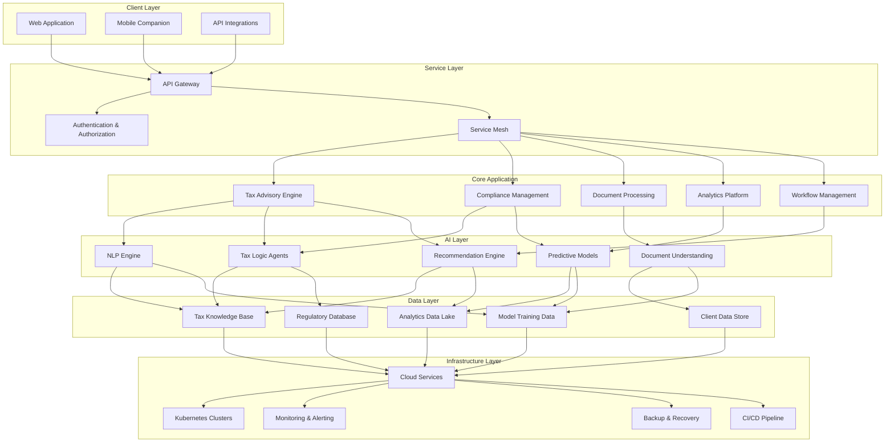
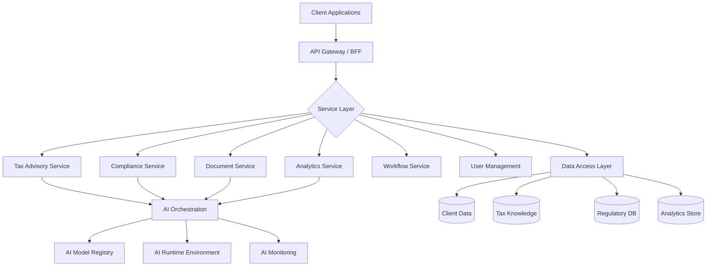
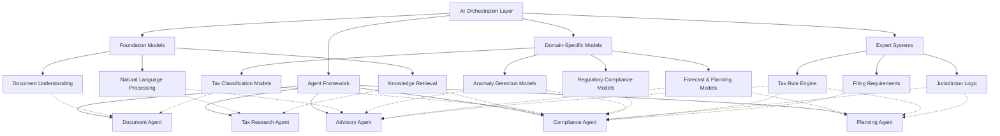
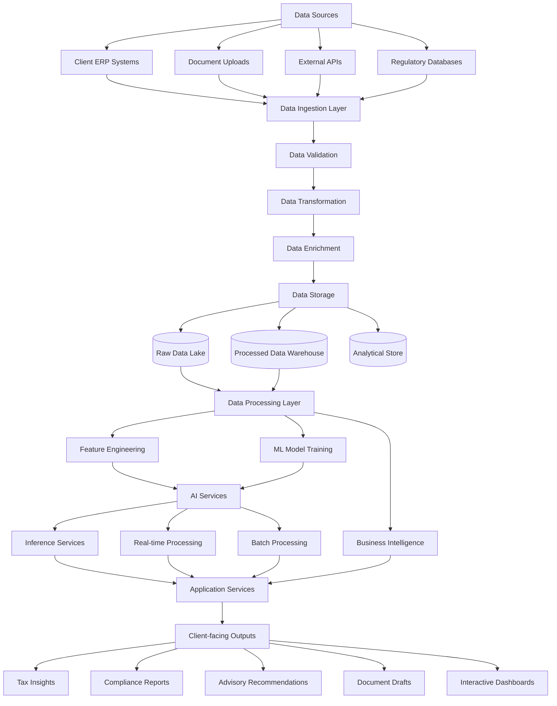
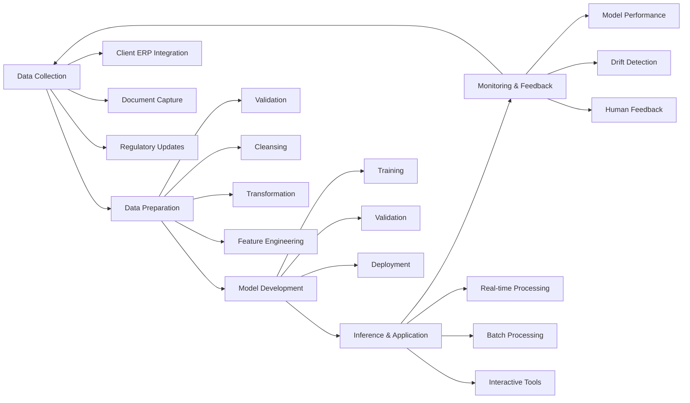
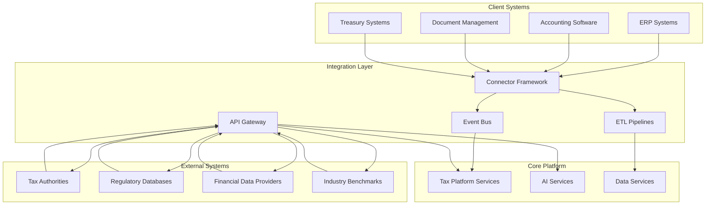

# ⚙️ System Architecture

*Cutting-edge AI technology meets enterprise-grade infrastructure*

<b>📗 Table of Contents</b>

- [🏗️ Architectural Overview](#%EF%B8%8F-architectural-overview)
- [🧩 Core Components](#-core-components)
- [🧠 AI Engine Architecture](#-ai-engine-architecture)
- [🔄 Data Flow & Processing](#-data-flow--processing)
- [🔌 Integration Architecture](#-integration-architecture)
- [🔒 Security Framework](#-security-framework)
- [⚡ Scalability & Performance](#-scalability--performance)

---

## 🏗️ Architectural Overview

> "Our cloud-native architecture provides the foundation for scalable, secure, and intelligent tax services."

Our system architecture follows a modern, cloud-native approach with microservices, containerization, and a multi-tiered AI strategy:

## 🧩 Core Components

> "Modular components working in concert to deliver a comprehensive tax intelligence platform."

### Component Architecture

### Detailed Component Specifications

| Component | Description | Technologies | Responsibilities |
|-----------|-------------|--------------|------------------|
| **API Gateway** | Entry point for all client requests | API Gateway, Kong, GraphQL | Request routing, authentication, rate limiting |
| **Tax Advisory Service** | Core tax planning and advisory logic | Microservice, Spring Boot, Go | Tax optimization, scenario planning, advisory workflow |
| **Compliance Service** | Manages regulatory compliance | Microservice, Node.js, Java | Compliance checks, regulatory updates, filing management |
| **Document Service** | Document processing & management | Microservice, Python, NLP | Form recognition, data extraction, document generation |
| **Analytics Service** | Data analytics and insights | Microservice, Python, Apache Spark | Data processing, reporting, insights generation |
| **Workflow Service** | Manages process workflows | Microservice, Temporal, BPMN | Workflow orchestration, status tracking, notifications |
| **User Management** | User authentication and roles | Identity Provider, OAuth, RBAC | Authentication, authorization, user profiles |
| **AI Orchestration** | Coordinates AI services | MLflow, KubeFlow, Python | Model selection, inference routing, ensemble methods |
| **Data Access Layer** | Data persistence & retrieval | ORM, GraphQL, REST | Data CRUD operations, consistency, caching |

## 🧠 AI Engine Architecture

> "Specialized AI models working together to tackle the complexity of corporate taxation."

Our AI architecture employs a multi-tier approach with specialized models for different tax functions:

### AI Model Specifications

| Model Type | Purpose | Training Approach | Input Data | Output | Performance Metrics |
|------------|---------|-------------------|------------|--------|---------------------|
| **Document Understanding** | Extract structured data from tax documents | Transfer learning + supervised fine-tuning | Document images, PDFs, scans | Structured form data | F1 Score: 95%+ |
| **NLP Models** | Process and understand tax language | Domain-specific fine-tuning | Tax regulations, client queries, documents | Semantic understanding, intent classification | Accuracy: 90%+ |
| **Tax Classification** | Classify transactions and entities for tax purposes | Supervised learning with expert validation | Historical tax data, transaction records | Tax classifications, codes, treatments | Precision: 92%+ |
| **Regulatory Compliance** | Identify compliance requirements and risks | Ensemble models with rule systems | Regulatory text, jurisdictional data, client facts | Compliance requirements, risk scores | Recall: 95%+ |
| **Forecasting Models** | Predict tax liabilities and opportunities | Time series + causal models | Historical tax data, economic indicators | Tax projections, scenario analysis | MAPE: <5% |

## 🔄 Data Flow & Processing

> "Secure, efficient data pipelines transforming raw information into actionable tax insights."

The end-to-end data flow architecture through our system:

### Data Processing Pipeline

## 🔌 Integration Architecture

> "Seamless connections with client systems and external services for frictionless adoption."

Our integration architecture enables seamless connection with client systems and external services:

### Integration Methods

| Integration Type | Purpose | Technologies | Implementation Approach |
|------------------|---------|--------------|------------------------|
| **ERP Connectors** | Extract financial and transaction data | REST APIs, SFTP, Database Connectors | Standardized adaptors for major ERP systems (SAP, Oracle, NetSuite) |
| **Accounting Software** | Financial statement and GL data | REST APIs, CSV Import, Direct DB | Certified integrations with common accounting platforms |
| **Tax Authority APIs** | Filing submissions, status checks | SOAP, REST, XML | Country-specific integrations with tax authorities |
| **Document Exchange** | Secure document transfer | SFTP, Secure API, Webhook | Bi-directional document flows with chain of custody |
| **Event-Driven** | Real-time updates and notifications | Kafka, RabbitMQ, Event Grid | Publish-subscribe architecture for system events |

## 🔒 Security Framework

> "Enterprise-grade security protecting sensitive tax data at every layer of our platform."

Comprehensive security architecture to protect sensitive tax and financial data:

```mermaid
flowchart TD
    A[Security Framework] --> B[Identity & Access]
    A --> C[Data Protection]
    A --> D[Network Security]
    A --> E[Application Security]
    A --> F[Compliance & Governance]
    
    B --> B1[Identity Provider]
    B --> B2[MFA]
    B --> B3[SSO]
    B --> B4[RBAC]
    B --> B5[Privileged Access]
    
    C --> C1[Encryption at Rest]
    C --> C2[Encryption in Transit]
    C --> C3[Key Management]
    C --> C4[Data Masking]
    C --> C5[Tokenization]
    
    D --> D1[Firewalls]
    D --> D2[WAF]
    D --> D3[Network Segmentation]
    D --> D4[DDoS Protection]
    D --> D5[Zero Trust Model]
    
    E --> E1[SAST]
    E --> E2[DAST]
    E --> E3[Dependency Scanning]
    E --> E4[Container Security]
    E --> E5[API Security]
    
    F --> F1[Audit Logging]
    F --> F2[Compliance Monitoring]
    F --> F3[Vulnerability Management]
    F --> F4[Pen Testing]
    F --> F5[Security Certifications]
```

### Security Controls

| Security Domain | Key Controls | Implementation Approach | Standards Compliance |
|-----------------|--------------|-------------------------|----------------------|
| **Identity & Access** | • Zero Trust Architecture • Multi-factor Authentication • Role-based Access Control • Just-in-time Access | • Identity Provider with MFA • Granular permission model • Regular access reviews • Privileged Access Management | ISO 27001, NIST 800-53 |
| **Data Protection** | • End-to-end Encryption • Data Loss Prevention • Data Classification • Retention Policies | • Field-level encryption • Client-specific encryption keys • Automated data classification • Jurisdictional data controls | GDPR, CCPA, SOC 2 |
| **Application Security** | • Secure SDLC • Code Scanning • Dependency Management • Container Security | • DevSecOps pipeline integration • Automated security testing • Vulnerability management • Container image scanning | OWASP Top 10, NIST 800-53 |
| **Infrastructure Security** | • Defense-in-depth • Network Segmentation • Monitoring & Detection • Secure Cloud Configuration | • Cloud security architecture • Micro-segmentation • SIEM integration • Infrastructure as Code scanning | CIS Benchmarks, ISO 27017 |
| **Compliance** | • Regulatory Compliance • Audit Readiness • Control Framework • Certification Maintenance | • Compliance monitoring • Automated evidence collection • Control mapping • Regular assessments | SOC 2, ISO 27001, GDPR |

## ⚡ Scalability & Performance

> "Designed for speed and growth, from startups to global enterprises."

Architecture designed for elastic scalability and high performance:

```mermaid
graph TB
    A[Scalability & Performance] --> B[Horizontal Scaling]
    A --> C[Vertical Scaling]
    A --> D[Caching Strategy]
    A --> E[Load Balancing]
    A --> F[Database Optimization]
    
    B --> B1[Microservices Architecture]
    B --> B2[Kubernetes Autoscaling]
    B --> B3[Serverless Functions]
    
    C --> C1[Compute Optimization]
    C --> C2[Memory Tuning]
    C --> C3[Resource Allocation]
    
    D --> D1[Application Caching]
    D --> D2[CDN]
    D --> D3[API Response Caching]
    D --> D4[Database Query Caching]
    
    E --> E1[Global Load Balancing]
    E --> E2[Service Mesh]
    E --> E3[Rate Limiting]
    
    F --> F1[Indexing Strategy]
    F --> F2[Query Optimization]
    F --> F3[Replication]
    F --> F4[Sharding]
```

### Performance Metrics & Targets

| System Component | Performance Metric | Target Value | Scaling Approach |
|------------------|-------------------|--------------|------------------|
| **Web Application** | Response Time Concurrent Users | <200ms P95 10,000+ | Horizontal scaling CDN Optimized frontend |
| **API Layer** | Throughput Latency | 5,000+ RPS <100ms P95 | API Gateway autoscaling Response caching Circuit breakers |
| **Processing Engine** | Batch Processing Time Real-time Processing | <1hr for largest clients <500ms P95 | Distributed processing Event-driven architecture Resource optimization |
| **AI Inference** | Inference Time Model Loading | <1s for complex questions <5s for new models | GPU acceleration Model optimization Inference caching |
| **Data Storage** | Query Response Write Throughput | <100ms P95 10,000+ TPS | Indexing strategy Query optimization Read replicas |
