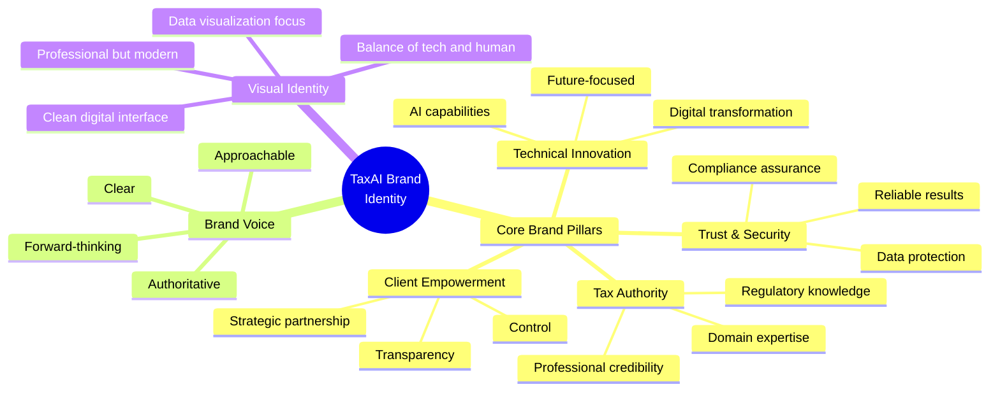
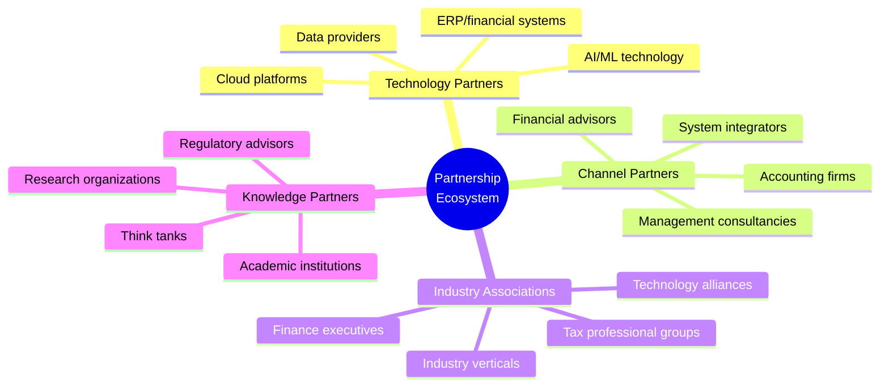
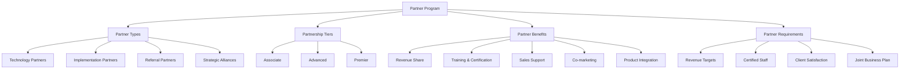
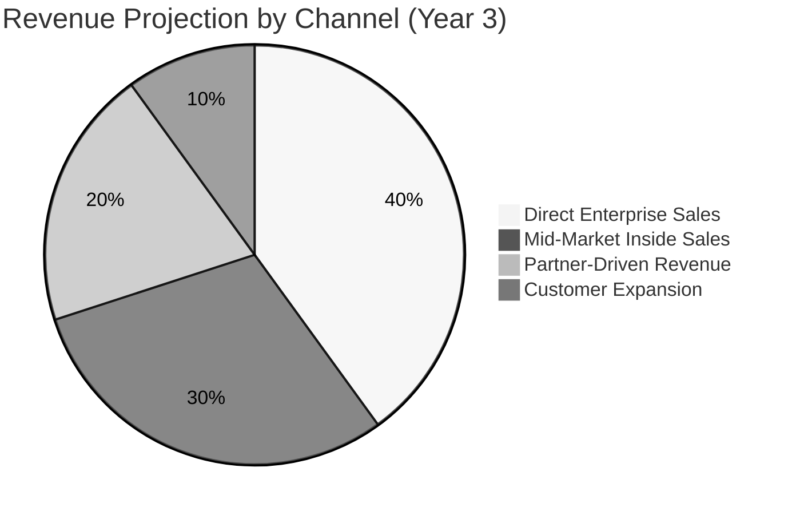

# Marketing Plan

This section outlines our comprehensive marketing strategy for launching and scaling an AI-powered corporate tax consulting business. It covers branding, digital marketing, content strategy, partnership approaches, and growth metrics.

## Table of Contents
- [Brand Strategy](#brand-strategy)
- [Market Positioning](#market-positioning)
- [Digital Marketing](#digital-marketing)
- [Content Strategy](#content-strategy)
- [Partnership Approach](#partnership-approach)
- [Sales Strategy](#sales-strategy)
- [Growth Metrics](#growth-metrics)

## Brand Strategy

Our brand strategy is designed to position us at the intersection of tax expertise and technological innovation:



### Brand Positioning Statement

**For** corporate tax leaders and finance executives **who** struggle with increasing regulatory complexity and limited resources, **our AI-powered tax consulting platform** delivers unprecedented efficiency and accuracy by combining advanced artificial intelligence with tax expertise, **unlike** traditional consulting firms or standalone software, **we provide** an integrated solution that reduces compliance burden while uncovering strategic opportunities.

## Market Positioning

```mermaid
quadrant-chart
    title Market Positioning Matrix
    x-axis Traditional to Innovative
    y-axis Generalist to Specialist
    quadrant-1 Innovation Leaders
    quadrant-2 Niche Innovators
    quadrant-3 Traditional Generalists
    quadrant-4 Specialist Incumbents
    "Our Position": [0.8, 0.85]
    "Big 4 Firms": [0.45, 0.4]
    "Tax Software Vendors": [0.7, 0.6]
    "RegTech Startups": [0.85, 0.5]
    "Boutique Tax Firms": [0.3, 0.8]
    "ERP Providers": [0.6, 0.3]
```

### Competitive Differentiation

| Competitor Type | Their Strengths | Their Limitations | Our Differentiation |
|-----------------|----------------|-------------------|---------------------|
| **Big 4 Firms** | • Global reach<br>• Established reputation<br>• Full-service offering | • High cost structure<br>• Less tech-forward<br>• Resource intensive | • AI-first approach<br>• Greater efficiency<br>• More cost-effective |
| **Tax Software** | • Established products<br>• Wide user base<br>• Compliance focus | • Limited advisory<br>• Generic solutions<br>• Less customization | • Combined tech + expertise<br>• Advanced AI capabilities<br>• Advisory-focused |
| **Boutique Firms** | • Specialized expertise<br>• Personalized service<br>• Agility | • Limited tech capabilities<br>• Scale challenges<br>• Narrow focus | • Tech-enabled expertise<br>• Scalable model<br>• Broader capabilities |
| **RegTech Startups** | • Innovative technology<br>• Specific use cases<br>• Digital natives | • Less tax expertise<br>• Limited track record<br>• Narrow solutions | • Deep tax domain expertise<br>• End-to-end solution<br>• Strategic advisory |

## Digital Marketing

Our multi-channel digital marketing approach:

```mermaid
flowchart TB
    A[Digital Marketing Strategy] --> B[Search Engine Marketing]
    A --> C[Content Marketing]
    A --> D[Social Media]
    A --> E[Email Marketing]
    A --> F[Events & Webinars]
    A --> G[Account-Based Marketing]
    
    B --> B1[SEO Strategy]
    B --> B2[Paid Search]
    
    B1 --> B1a[Tax-specific keywords]
    B1 --> B1b[Thought leadership]
    B1 --> B1c[Technical authority]
    
    B2 --> B2a[Google Ads]
    B2 --> B2b[LinkedIn Advertising]
    
    C --> C1[Blog Content]
    C --> C2[Whitepapers & Research]
    C --> C3[Case Studies]
    C --> C4[Video Content]
    
    D --> D1[LinkedIn Strategy]
    D --> D2[Twitter Presence]
    D --> D3[YouTube Channel]
    
    E --> E1[Drip Campaigns]
    E --> E2[Newsletter]
    E --> E3[Personalized Outreach]
    
    F --> F1[Industry Conferences]
    F --> F2[Educational Webinars]
    F --> F3[Executive Roundtables]
    
    G --> G1[Target Account Selection]
    G --> G2[Multi-channel Approach]
    G --> G3[Personalized Content]
```



### Channel Strategy & KPIs

| Channel | Primary Purpose | Target Audience | Key Tactics | Success Metrics |
|---------|----------------|----------------|-------------|-----------------|
| **SEO/SEM** | Demand generation | Research-stage prospects | • Tax AI keyword targeting<br>• Technical content optimization<br>• Featured snippets targeting | • Organic traffic growth<br>• Search rankings<br>• Qualified lead volume |
| **LinkedIn** | Brand authority & lead generation | Tax executives & finance leaders | • Thought leadership content<br>• Industry group participation<br>• Targeted sponsored content | • Engagement rate<br>• Leads generated<br>• Connection growth |
| **Content Marketing** | Education & trust building | Multiple decision makers | • Tax insight reports<br>• AI in tax research<br>• Case study showcases | • Content downloads<br>• Time on page<br>• Attribution to pipeline |
| **Webinars** | Deep education & lead qualification | Engaged prospects | • Topic-specific deep dives<br>• Live demos<br>• Expert panel discussions | • Registration/attendance<br>• Engagement metrics<br>• Conversion to sales calls |
| **Email** | Nurturing & relationship building | Database contacts | • Segmented workflows<br>• Personalized content<br>• Behavioral triggers | • Open & click rates<br>• Pipeline influence<br>• Conversion rates |

## Content Strategy

Content marketing forms the foundation of our marketing approach:

```mermaid
graph TD
    A[Content Strategy] --> B[Content Pillars]
    A --> C[Content Formats]
    A --> D[Distribution Channels]
    A --> E[Content Journey]
    
    B --> B1["Tax Technology Transformation"]
    B --> B2["AI Applications in Tax"]
    B --> B3["Regulatory Navigation"]
    B --> B4["Strategic Tax Planning"]
    B --> B5["Tax Function Efficiency"]
    
    C --> C1[Blog Articles]
    C --> C2[Whitepapers]
    C --> C3[Case Studies]
    C --> C4[Video Content]
    C --> C5[Interactive Tools]
    C --> C6[Podcasts]
    C --> C7[Webinars]
    
    D --> D1[Website]
    D --> D2[Email]
    D --> D3[Social Media]
    D --> D4[Industry Publications]
    D --> D5[Events]
    D --> D6[Partner Channels]
    
    E --> E1[Awareness]
    E --> E2[Consideration]
    E --> E3[Decision]
    E --> E4[Implementation]
    E --> E5[Expansion]
    
    E1 --> C1
    E1 --> C4
    E1 --> C6
    
    E2 --> C2
    E2 --> C5
    E2 --> C7
    
    E3 --> C3
    E3 --> C7
    
    E4 --> C3
    E4 --> C5
    
    E5 --> C2
    E5 --> C3
```



### Content Calendar (First 6 Months)

| Month | Content Theme | Flagship Content | Supporting Content | Promotional Approach |
|-------|--------------|------------------|---------------------|----------------------|
| **1** | Introduction to AI in Tax | Whitepaper: "The Future of Corporate Tax: AI Transformation" | • 3 blog posts<br>• Expert interview series<br>• Social media campaign | • LinkedIn promotion<br>• Email announcement<br>• Industry publication placement |
| **2** | Compliance Automation | Video Series: "From Manual to Automated: The Tax Compliance Journey" | • Case study<br>• Process assessment tool<br>• Compliance webinar | • YouTube channel launch<br>• Paid social promotion<br>• Partner co-marketing |
| **3** | Cost of Tax Errors | Research Report: "The True Cost of Tax Errors: 2025 Benchmark Study" | • ROI calculator<br>• Industry-specific briefs<br>• Testimonial videos | • Press release<br>• Influencer sharing<br>• Webinar presentation |
| **4** | Strategic Tax Planning | Interactive Guide: "AI-Powered Tax Strategy Playbook" | • Planning workshop<br>• Executive interviews<br>• Decision framework | • Executive event series<br>• Account-based campaigns<br>• Partner distribution |
| **5** | Tax Technology Implementation | Case Study Collection: "Tax Transformation Success Stories" | • Implementation roadmap<br>• Maturity assessment<br>• Expert roundtable | • Client co-presentation<br>• Industry conference<br>• Targeted email campaign |
| **6** | Regulatory Intelligence | Forecast Report: "Tax Regulatory Trends: AI-Powered Predictions" | • Regulatory update webinar<br>• Jurisdiction guides<br>• Compliance checklist | • Regulatory body outreach<br>• Professional association partnerships<br>• Media coverage |

## Partnership Approach

Strategic partnerships will accelerate our market entry and growth:



### Partner Program Structure



## Sales Strategy

```mermaid
flowchart TB
    A[Sales Strategy] --> B[Sales Model]
    A --> C[Sales Process]
    A --> D[Team Structure]
    A --> E[Enablement]
    
    B --> B1[Direct Enterprise: Complex Sales]
    B --> B2[Inside Sales: Mid-Market]
    B --> B3[Partner-Led: Lower Mid-Market]
    
    C --> C1[Lead Qualification]
    C --> C2[Discovery & Assessment]
    C --> C3[Solution Presentation]
    C --> C4[Value Demonstration]
    C --> C5[Negotiation & Close]
    C --> C6[Implementation Handoff]
    
    D --> D1[Enterprise Account Executives]
    D --> D2[Solution Consultants]
    D --> D3[Inside Sales Representatives]
    D --> D4[Partner Account Managers]
    
    E --> E1[Sales Playbooks]
    E --> E2[Technical Training]
    E --> E3[Competitive Intelligence]
    E --> E4[Demonstration Environment]
```



### Sales Cycle & Approach

| Sales Stage | Key Activities | Tools & Resources | Typical Duration |
|-------------|---------------|-------------------|------------------|
| **Lead Generation** | • Inbound marketing<br>• Targeted outreach<br>• Event follow-up<br>• Partner referrals | • Content marketing<br>• LinkedIn Sales Navigator<br>• ABM platform<br>• Partner portal | Ongoing |
| **Qualification** | • BANT assessment<br>• Problem validation<br>• Stakeholder mapping | • Qualification script<br>• Pain point assessment<br>• Stakeholder matrix | 1-2 weeks |
| **Discovery** | • Current state analysis<br>• Pain point deep dive<br>• Success criteria definition | • Tax process assessment<br>• ROI calculator<br>• Technical questionnaire | 2-4 weeks |
| **Solution Presentation** | • Custom demo<br>• Solution mapping<br>• Technical validation | • Demo environment<br>• Case studies<br>• Technical documentation | 1-2 weeks |
| **Proof of Concept** | • Limited implementation<br>• Value demonstration<br>• Success measurement | • POC framework<br>• Success metrics<br>• Technical support | 3-6 weeks |
| **Negotiation & Close** | • Proposal preparation<br>• Contract negotiation<br>• Implementation planning | • Proposal template<br>• Contract framework<br>• Legal support | 2-4 weeks |

## Growth Metrics

Key performance indicators to track marketing and sales effectiveness:

```mermaid
graph TB
    A[Growth Metrics Framework] --> B[Acquisition Metrics]
    A --> C[Engagement Metrics]
    A --> D[Conversion Metrics]
    A --> E[Revenue Metrics]
    A --> F[Retention Metrics]
    
    B --> B1[Website Traffic]
    B --> B2[MQLs Generated]
    B --> B3[CAC by Channel]
    B --> B4[Brand Awareness]
    
    C --> C1[Content Engagement]
    C --> C2[Email Performance]
    C --> C3[Social Engagement]
    C --> C4[Event Participation]
    
    D --> D1[MQL to SQL Rate]
    D --> D2[SQL to Opportunity]
    D --> D3[Opportunity to Close]
    D --> D4[Sales Cycle Length]
    
    E --> E1[ARR Growth]
    E --> E2[ACV Trends]
    E --> E3[LTV Projections]
    E --> E4[Revenue by Segment]
    
    F --> F1[Churn Rate]
    F --> F2[Expansion Revenue]
    F --> F3[Net Revenue Retention]
    F --> F4[Customer Health]
```



### Growth Projections



### Marketing Budget Allocation

```mermaid
sankey-beta
    Marketing Budget,Content Development,25
    Marketing Budget,Digital Advertising,20
    Marketing Budget,Events & Sponsorships,15
    Marketing Budget,SEO & Website,15
    Marketing Budget,Partner Marketing,10
    Marketing Budget,Sales Enablement,10
    Marketing Budget,Brand Development,5
    
    Content Development,Thought Leadership,10
    Content Development,Case Studies,5
    Content Development,Video Production,5
    Content Development,Interactive Tools,5
    
    Digital Advertising,LinkedIn,10
    Digital Advertising,Google,5
    Digital Advertising,Retargeting,3
    Digital Advertising,Industry Publications,2
    
    Events & Sponsorships,Industry Conferences,8
    Events & Sponsorships,Webinars,4
    Events & Sponsorships,Executive Events,3
```

### Quarterly KPI Targets (Year 1)

| Metric | Q1 | Q2 | Q3 | Q4 |
|--------|----|----|----|----|
| **Website Visitors** | 5,000 | 10,000 | 20,000 | 40,000 |
| **MQLs Generated** | 100 | 250 | 500 | 750 |
| **SQLs Converted** | 20 | 50 | 100 | 150 |
| **Opportunities Created** | 10 | 25 | 50 | 75 |
| **Closed Deals** | 2 | 8 | 15 | 25 |
| **ARR Bookings** | $100K | $400K | $750K | $1.25M |
| **CAC Ratio** | 1.5 | 1.2 | 1.0 | 0.8 |
| **Partner-Sourced Leads** | 20 | 50 | 100 | 200 |
