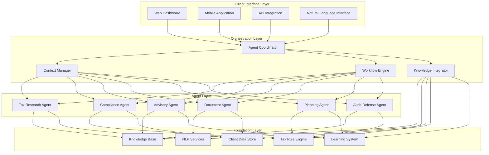
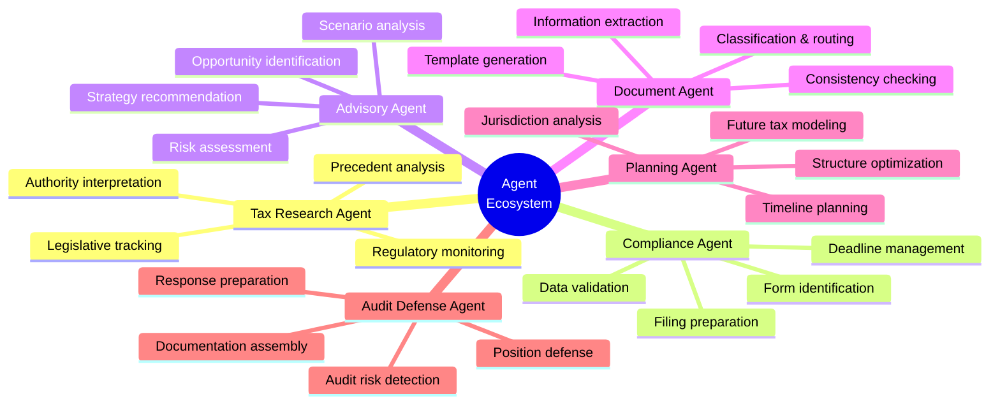
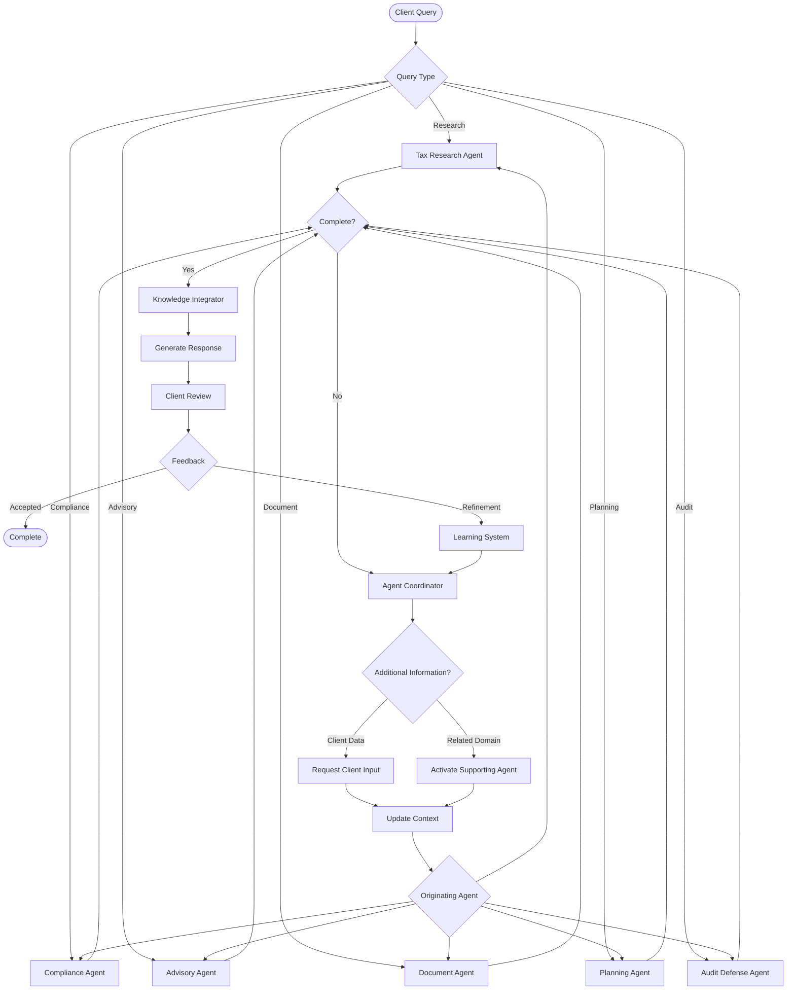
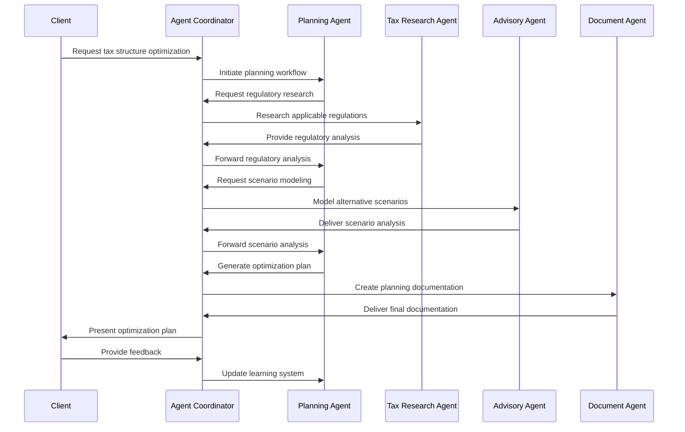
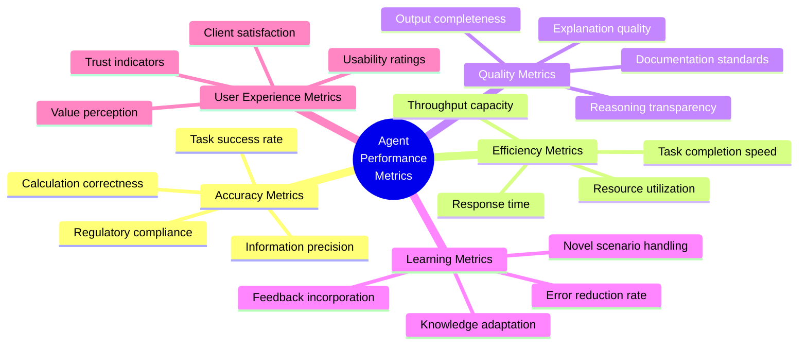
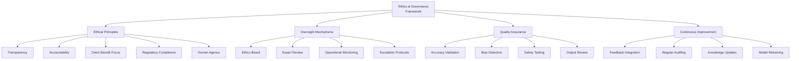
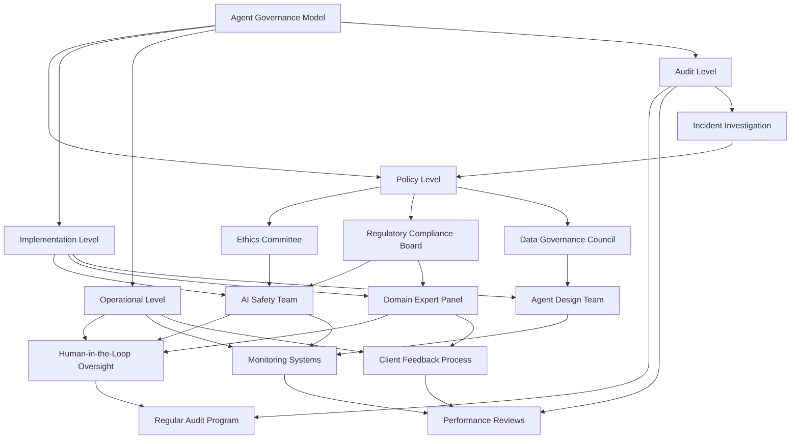

# Unified Agents

This section defines the AI agent architecture that powers our corporate tax consulting solution. These unified agents combine tax domain expertise with advanced AI capabilities to deliver intelligent, automated tax services.

## Table of Contents
- [Agent Framework Overview](#agent-framework-overview)
- [Agent Types & Capabilities](#agent-types--capabilities)
- [Agent Interactions & Workflow](#agent-interactions--workflow)
- [Agent Development Methodology](#agent-development-methodology)
- [Performance Metrics & Optimization](#performance-metrics--optimization)
- [Ethical Guidelines & Governance](#ethical-guidelines--governance)

## Agent Framework Overview

Our unified agent architecture provides the intelligent foundation for our tax consulting platform:



### Core Architectural Components

| Component | Purpose | Key Functions | Technical Implementation |
|-----------|---------|--------------|--------------------------|
| **Agent Coordinator** | Orchestrates agent interactions | • Route user requests<br>• Manage agent cooperation<br>• Track task completion | • Hierarchical planning<br>• Priority-based execution<br>• State management |
| **Context Manager** | Maintains coherent understanding | • Preserve conversation history<br>• Track entity references<br>• Maintain client context | • Context window management<br>• Entity recognition & tracking<br>• Client profile integration |
| **Workflow Engine** | Manages multi-step processes | • Define process templates<br>• Track task progression<br>• Handle dependencies | • BPMN workflow execution<br>• State machine implementation<br>• Event-driven architecture |
| **Knowledge Integrator** | Connects agents with information | • Retrieve relevant knowledge<br>• Integrate multiple sources<br>• Update knowledge base | • Vector search<br>• Knowledge graph navigation<br>• Retrieval augmentation |

## Agent Types & Capabilities

Our tax consulting platform employs specialized agents with distinct capabilities:



### Agent Capabilities Matrix

```mermaid
quadrant-chart
    title Agent Capability Matrix
    x-axis Rule-based to Learning-based
    y-axis Operational to Strategic
    quadrant-1 Strategic Intelligence
    quadrant-2 Learning Operations
    quadrant-3 Rule Enforcement
    quadrant-4 Decision Support
    "Tax Research Agent": [0.65, 0.75]
    "Compliance Agent": [0.25, 0.15]
    "Advisory Agent": [0.8, 0.9]
    "Document Agent": [0.45, 0.25]
    "Planning Agent": [0.7, 0.85]
    "Audit Defense Agent": [0.4, 0.6]
```

### Detailed Agent Specifications

#### Tax Research Agent

| Aspect | Details |
|--------|---------|
| **Primary Function** | Research and interpret tax laws, regulations, and precedents |
| **Capabilities** | • Monitor regulatory changes<br>• Analyze legislative developments<br>• Evaluate precedent cases<br>• Interpret authority positions |
| **Input Types** | • Tax questions<br>• Regulatory citations<br>• Jurisdiction specifications<br>• Client profiles |
| **Output Types** | • Regulatory summaries<br>• Research memos<br>• Authority positions<br>• Precedent analyses |
| **Key Technologies** | • NLP for legal text<br>• Knowledge graph navigation<br>• Citation analysis<br>• Semantic search |
| **Human Augmentation** | • Expert review for complex interpretations<br>• Final validation of positions<br>• Edge case handling |

#### Compliance Agent

| Aspect | Details |
|--------|---------|
| **Primary Function** | Ensure accurate and timely compliance with tax regulations |
| **Capabilities** | • Identify required filings<br>• Validate data completeness<br>• Prepare filing documents<br>• Track deadlines and requirements |
| **Input Types** | • Financial data<br>• Entity information<br>• Prior filings<br>• Jurisdictional rules |
| **Output Types** | • Completed tax forms<br>• Filing checklists<br>• Compliance calendars<br>• Error reports |
| **Key Technologies** | • Form recognition<br>• Data validation rules<br>• Deadline tracking<br>• Cross-reference checking |
| **Human Augmentation** | • Review of complex filings<br>• Exception handling<br>• Material decision validation |

## Agent Interactions & Workflow

The agents work together in coordinated workflows to address complex tax scenarios:



### Multi-Agent Collaboration Example: Tax Planning Scenario



## Agent Development Methodology

Our approach to building, training and improving our tax agents:

```mermaid
graph TD
    A[Agent Development<br>Methodology] --> B[Design Phase]
    A --> C[Training Phase]
    A --> D[Testing Phase]
    A --> E[Deployment Phase]
    A --> F[Improvement Phase]
    
    B --> B1[Capability Definition]
    B --> B2[Knowledge Boundary]
    B --> B3[Interaction Model]
    B --> B4[Technical Architecture]
    
    C --> C1[Base Model Selection]
    C --> C2[Domain Fine-tuning]
    C --> C3[Red-teaming]
    C --> C4[Human Feedback]
    
    D --> D1[Technical Validation]
    D --> D2[Domain Accuracy]
    D --> D3[Edge Case Testing]
    D --> D4[Human Evaluation]
    
    E --> E1[Controlled Rollout]
    E --> E2[Monitoring System]
    E --> E3[Feedback Collection]
    E --> E4[Expert Oversight]
    
    F --> F1[Usage Analysis]
    F --> F2[Error Pattern Review]
    F --> F3[Knowledge Updates]
    F --> F4[Model Retraining]
```



### Agent Training Methodology

| Training Stage | Approach | Data Sources | Validation Methods |
|----------------|----------|--------------|-------------------|
| **Base Model Selection** | Evaluate pre-trained foundation models for tax suitability | • General language models<br>• Industry-specific models<br>• Capability benchmarks | • Tax domain benchmarks<br>• Task-specific evaluations<br>• Efficiency metrics |
| **Domain Knowledge Integration** | Inject tax-specific knowledge and reasoning | • Tax regulations<br>• IRS publications<br>• Case law<br>• Accounting standards | • Knowledge testing<br>• Citation accuracy<br>• Reasoning validation |
| **Supervised Fine-tuning** | Optimize for tax-specific tasks | • Expert-labeled data<br>• Historical tax scenarios<br>• Client interactions | • Task completion metrics<br>• Expert evaluation<br>• Comparative analysis |
| **Red-teaming & Safety** | Identify and address weaknesses | • Adversarial prompts<br>• Edge case scenarios<br>• Ethical challenges | • Failure mode analysis<br>• Recovery performance<br>• Safety evaluation |
| **Human Feedback** | Incorporate expert guidance | • Tax professional review<br>• Client feedback<br>• Quality assessments | • RLHF metrics<br>• Preference alignment<br>• Satisfaction scores |

## Performance Metrics & Optimization

We measure and optimize our agents using a comprehensive metrics framework:



### Agent-Specific Performance Targets

| Agent Type | Primary Metrics | Target Thresholds | Optimization Methods |
|------------|----------------|-------------------|----------------------|
| **Tax Research Agent** | • Citation accuracy<br>• Research completeness<br>• Interpretation correctness | • >95% citation accuracy<br>• >90% coverage of relevant authorities<br>• >85% expert agreement | • Knowledge base expansion<br>• Retrieval optimization<br>• Expert validation loops |
| **Compliance Agent** | • Form accuracy<br>• Validation thoroughness<br>• Deadline adherence | • >99% form accuracy<br>• >95% error detection<br>• 100% deadline compliance | • Rule engine refinement<br>• Cross-validation checks<br>• Exception handling improvement |
| **Advisory Agent** | • Strategy quality<br>• Scenario coverage<br>• Risk assessment accuracy | • >85% expert agreement<br>• >90% scenario comprehensiveness<br>• >80% risk prediction accuracy | • Case library expansion<br>• Scenario modeling enhancement<br>• Comparative analysis |
| **Document Agent** | • Information extraction accuracy<br>• Document consistency<br>• Template adherence | • >95% data extraction accuracy<br>• >90% consistency rating<br>• >95% template compliance | • Document understanding tuning<br>• Pattern recognition training<br>• Template optimization |
| **Planning Agent** | • Strategy effectiveness<br>• Modeling accuracy<br>• Optimization impact | • >15% tax savings identified<br>• >85% forecasting accuracy<br>• >90% compliance confidence | • Optimization algorithm tuning<br>• Multi-jurisdiction modeling<br>• Scenario expansion |
| **Audit Defense Agent** | • Risk detection accuracy<br>• Documentation quality<br>• Position defensibility | • >90% risk detection<br>• >95% documentation completeness<br>• >85% position success rate | • Audit pattern analysis<br>• Documentation standards<br>• Precedent integration |

## Ethical Guidelines & Governance

Our agent system operates under strict ethical principles and governance:



### Agent Governance Structure



### Ethical Safeguards for Agent Deployment

| Area | Safeguard Measures | Implementation | Monitoring |
|------|-------------------|----------------|-----------|
| **Transparency** | • Reasoning visibility<br>• Confidence indicators<br>• Source citations | • Explainable AI techniques<br>• Confidence score display<br>• Citation linking | • Explanation quality reviews<br>• User understanding testing<br>• Citation accuracy checks |
| **Accuracy & Truth** | • Fact verification<br>• Multiple source validation<br>• Uncertainty disclosure | • Knowledge verification system<br>• Cross-reference checking<br>• Explicit uncertainty flagging | • Fact check audits<br>• Source diversity analysis<br>• Uncertainty handling review |
| **Privacy & Security** | • Data minimization<br>• Access controls<br>• Anonymization where possible | • Need-to-know data access<br>• Encryption at rest/transit<br>• Anonymization techniques | • Privacy impact assessments<br>• Security penetration testing<br>• Data access audits |
| **Human Oversight** | • Expert review of outputs<br>• Escalation pathways<br>• Override capabilities | • Review workflow integration<br>• Clear escalation protocols<br>• Manual override controls | • Review effectiveness metrics<br>• Escalation response times<br>• Override pattern analysis |
| **Regulatory Compliance** | • Regulatory validation<br>• Conservative interpretation<br>• Jurisdictional boundaries | • Regulatory checking system<br>• Conservative default positions<br>• Jurisdiction-specific controls | • Compliance audits<br>• Regulatory update tracking<br>• Jurisdictional boundary testing |
