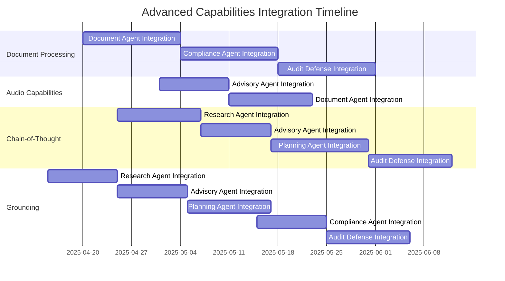

<div align="center">

# 🔬 Advanced Gemini Capabilities for TaxFlo Agents


*Leveraging the full spectrum of Gemini 2.5 Pro capabilities for tax consulting*

</div>

## 📋 Table of Contents

1. [Document Processing](#-document-processing)
2. [Audio Capabilities](#-audio-capabilities)
3. [Chain-of-Thought Reasoning](#-chain-of-thought-reasoning)
4. [Grounding Capabilities](#-grounding-capabilities)
5. [Agent Enhancement Strategy](#-agent-enhancement-strategy)

---

## 📄 Document Processing

> The Gemini Document API enables sophisticated analysis of tax documents, a critical capability for our platform.

### Key Capabilities

The Gemini Document API offers several advanced capabilities particularly relevant to tax document processing:

- **Native PDF processing**: Direct handling of complex tax forms in PDF format
- **Document chunking**: Breaking down lengthy tax documents into manageable sections
- **Document understanding**: Comprehending structure, layout, and relationships in tax documents
- **Form extraction**: Identifying and extracting data from structured tax forms
- **Table handling**: Processing tabular data common in tax documents

### Implementation Strategy

```javascript
/**
 * Processes tax documents using Gemini Document API
 * @param {string} fileUrl - URL to the tax document
 * @param {string} documentType - Type of tax document
 * @returns {object} Structured tax document data
 */
async function processTaxDocument(fileUrl, documentType) {
  // Initialize document processing
  const documentProcessor = new DocumentProcessor();
  
  // Configure processing based on document type
  const processingConfig = getTaxDocumentConfig(documentType);
  
  // Process the document
  const processedDocument = await documentProcessor.processDocument(
    fileUrl,
    processingConfig
  );
  
  // Extract structured data based on document type
  return extractTaxData(processedDocument, documentType);
}

/**
 * Returns processing configuration based on tax document type
 * @param {string} documentType - Type of tax document
 * @returns {object} Document processing configuration
 */
function getTaxDocumentConfig(documentType) {
  const configs = {
    "Form 1120": {
      chunking: {
        maxChunkSize: 4000,
        overlapSize: 200
      },
      extractionConfig: {
        headerNames: ["Gross receipts or sales", "Returns and allowances", "Cost of goods sold"],
        sections: ["Income", "Deductions", "Tax and Payments"],
        tableTypes: ["Balance Sheet", "Cost of Goods Sold"]
      },
      processingOptions: {
        extractForms: true,
        extractTables: true,
        ocr: true
      }
    },
    // Other document types...
  };
  
  return configs[documentType] || DEFAULT_DOCUMENT_CONFIG;
}
```

### Form Extraction Enhancement

Form extraction is particularly valuable for tax documents that follow standardized layouts:

```javascript
/**
 * Extracts structured data from a tax form
 * @param {object} processedDocument - Processed document from Document API
 * @param {string} formType - Specific tax form type
 * @returns {object} Structured form data
 */
function extractTaxFormData(processedDocument, formType) {
  // Get form extraction schema
  const formSchema = getTaxFormSchema(formType);
  
  // Extract form fields using schema
  const extractedFields = {};
  
  for (const field of formSchema.fields) {
    const fieldData = processedDocument.extractField(
      field.identifier,
      field.extractionRules
    );
    
    // Apply field-specific validation and formatting
    extractedFields[field.name] = validateAndFormatField(
      fieldData,
      field.dataType,
      field.validationRules
    );
  }
  
  // Extract tabular data if present
  if (formSchema.tables) {
    extractedFields.tables = {};
    
    for (const table of formSchema.tables) {
      extractedFields.tables[table.name] = processedDocument.extractTable(
        table.identifier,
        table.structureRules
      );
    }
  }
  
  return extractedFields;
}
```

### Agent Integration

Our Document Agent will leverage these capabilities to:

1. **Intake and Process**: Accept tax documents in various formats
2. **Classify**: Automatically identify document types (W-2, 1099, 1120, etc.)
3. **Extract**: Pull relevant data points following form-specific rules
4. **Validate**: Verify data consistency and flag potential issues
5. **Summarize**: Generate human-readable summaries of document contents
6. **Link**: Connect extracted data with advisory context

This significantly enhances our platform's ability to understand client tax situations by automatically processing their documentation.

---

## 🎤 Audio Capabilities

> The Gemini Audio API enables voice-based tax advisory and dictation capabilities.

### Key Capabilities

The Gemini Audio API provides capabilities that can enhance tax advisory interactions:

- **Voice input**: Clients can ask tax questions verbally
- **Speech recognition**: Accurate transcription of tax terminology
- **Voice output**: Natural-sounding responses to tax inquiries
- **Meeting transcription**: Capturing tax advisory sessions
- **Multilingual support**: Supporting international tax discussions

### Implementation Strategy

```javascript
/**
 * Processes audio input for tax advisory
 * @param {Buffer} audioData - Audio data from client
 * @returns {object} Transcription and tax response
 */
async function processTaxAudioQuery(audioData) {
  // Initialize audio processing with tax-specific configuration
  const audioProcessor = new GeminiAudioProcessor({
    modelType: "gemini-2.5-pro-preview-03-25",
    domainHints: ["finance", "taxation", "accounting"],
    specializedVocabulary: TAX_TERMINOLOGY
  });
  
  // Process audio to text with enhanced tax term recognition
  const transcription = await audioProcessor.transcribe(audioData);
  
  // Process the tax query
  const taxResponse = await getTaxAdvisory(transcription.text);
  
  // Generate audio response if requested
  let audioResponse = null;
  if (transcription.responseFormat === "audio") {
    audioResponse = await audioProcessor.generateSpeech(
      taxResponse.explanation,
      {
        voice: "professional",
        speed: 1.0,
        emphasis: {
          terms: extractImportantTaxTerms(taxResponse),
          level: "moderate"
        }
      }
    );
  }
  
  return {
    transcription: transcription.text,
    taxResponse,
    audioResponse
  };
}
```

### Meeting Transcription for Tax Advisory

```javascript
/**
 * Transcribes and analyzes tax advisory meetings
 * @param {string} meetingAudioUrl - URL to meeting recording
 * @returns {object} Transcription with tax insights
 */
async function processTaxAdvisoryMeeting(meetingAudioUrl) {
  // Process meeting audio
  const meetingProcessor = new GeminiMeetingProcessor();
  
  // Transcribe with speaker diarization
  const transcription = await meetingProcessor.transcribeMeeting(
    meetingAudioUrl,
    {
      diarization: true,
      speakerCount: 2, // Typically advisor and client
      domainContext: "tax advisory"
    }
  );
  
  // Extract key tax topics discussed
  const taxTopics = extractTaxTopics(transcription);
  
  // Identify action items
  const actionItems = extractTaxActionItems(transcription);
  
  // Generate meeting summary
  const summary = await generateTaxMeetingSummary(
    transcription,
    taxTopics,
    actionItems
  );
  
  return {
    transcription,
    taxTopics,
    actionItems,
    summary
  };
}
```

### Agent Integration

Our tax agents will be enhanced with audio capabilities:

1. **Voice Advisory**: Enable spoken tax consultations
2. **Mobile Accessibility**: Allow clients to receive tax advice on-the-go
3. **Meeting Documentation**: Capture and analyze client-advisor conversations
4. **Accessibility Enhancement**: Support clients with reading difficulties or preferences for audio
5. **Context Recognition**: Understand contextual cues in voice that might be missed in text

These capabilities create a more natural, accessible tax advisory experience that accommodates different user preferences.

---

## 🧠 Chain-of-Thought Reasoning

> The Gemini Thinking API enables transparent reasoning for complex tax scenarios.

### Key Capabilities

The chain-of-thought capabilities enable our tax agents to:

- **Show reasoning steps**: Walk through tax calculations step by step
- **Explain decisions**: Clarify the rationale behind tax advice
- **Consider alternatives**: Evaluate multiple tax strategies transparently
- **Handle complexity**: Break down intricate tax scenarios into manageable parts
- **Teach tax concepts**: Help clients understand tax principles through reasoning

### Implementation Strategy

```javascript
/**
 * Generates tax advice with visible reasoning steps
 * @param {string} taxQuery - Client's tax question
 * @param {object} context - Client's tax situation
 * @returns {object} Tax advice with reasoning chain
 */
async function getTaxAdviceWithReasoning(taxQuery, context) {
  // Configure thinking parameters for tax reasoning
  const thinkingConfig = {
    detailedThinking: true,
    reasoningSteps: true,
    alternativeConsideration: true,
    confidenceScores: true,
    citationTracking: true
  };
  
  // Generate response with visible thinking
  const response = await googleAI.generateContent({
    model: "gemini-2.5-pro-preview-03-25",
    systemInstruction: TAX_ADVISORY_WITH_REASONING_PROMPT,
    contents: [
      { 
        role: "user", 
        parts: [{ text: formatTaxQueryWithContext(taxQuery, context) }] 
      }
    ],
    generationConfig: {
      temperature: 0.2,
      thinking: thinkingConfig
    }
  });
  
  // Extract the reasoning chain and formatted response
  return {
    finalAdvice: extractTaxAdvice(response),
    reasoningChain: extractReasoningChain(response),
    alternativesConsidered: extractAlternatives(response),
    confidenceAssessment: extractConfidenceMetrics(response),
    taxCodeReferences: extractCitations(response)
  };
}
```

### Example Tax Reasoning Chain

```javascript
// Example structured reasoning for tax deduction question
const exampleReasoningChain = [
  {
    step: 1,
    reasoning: "Identifying the type of expense: Client is asking about home office expenses while working as an independent consultant.",
    taxPrinciple: "Expenses must be ordinary and necessary for the business to be deductible."
  },
  {
    step: 2,
    reasoning: "Determining if home office qualifies: The space is used regularly and exclusively for business, which is required by IRC § 280A.",
    taxPrinciple: "Regular and exclusive use test under IRC § 280A",
    confidence: 0.95
  },
  {
    step: 3,
    reasoning: "Considering deduction method options: Simplified ($5/sqft) vs. Regular (actual expenses).",
    alternatives: [
      {
        method: "Simplified",
        calculation: "300 sqft × $5 = $1,500 deduction",
        pros: "Simple, no depreciation recapture",
        cons: "May result in lower deduction than actual expenses"
      },
      {
        method: "Regular",
        calculation: "300/2000 home size = 15% of utilities, mortgage interest, etc.",
        pros: "Potentially larger deduction",
        cons: "Requires more documentation, depreciation recapture possible"
      }
    ],
    taxPrinciple: "Rev. Proc. 2013-13 for simplified method"
  },
  {
    step: 4,
    reasoning: "Calculating estimated deduction amounts based on provided information to compare approaches.",
    calculation: {
      simplified: 1500,
      regular: 3200
    },
    recommendation: "Regular method based on provided expense information",
    confidence: 0.87
  }
];
```

### Agent Integration

Our tax agents will leverage chain-of-thought capabilities to:

1. **Transparent Advisory**: Show reasoning behind tax recommendations
2. **Educational Value**: Help clients understand tax principles through reasoning
3. **Trust Building**: Demonstrate the logic supporting tax positions
4. **Complexity Management**: Break down complex tax scenarios into understandable steps
5. **Alternative Exploration**: Compare different tax approaches with transparent reasoning

This enhances trust and client understanding while providing more defensible tax positions with clear rationales.

---

## 🔍 Grounding Capabilities

> The Gemini Grounding API ensures tax advice is based on factual, up-to-date tax information.

### Key Capabilities

Grounding capabilities ensure our tax agents provide accurate, verifiable information:

- **Citation generation**: Reference specific tax code sections and regulations
- **Fact verification**: Ensure tax advice is based on current regulations
- **Source linking**: Connect advice to authoritative tax sources
- **Conflicting information handling**: Identify and address contradictions in tax guidance
- **Confidence indication**: Express certainty levels for different tax positions

### Implementation Strategy

```javascript
/**
 * Provides grounded tax advice with citations
 * @param {string} query - Client's tax question
 * @param {object} context - Client's tax situation
 * @returns {object} Grounded tax advice with citations
 */
async function getGroundedTaxAdvice(query, context) {
  // Prepare grounding sources specific to the tax domain
  const groundingSources = await prepareTaxGroundingSources(query, context);
  
  // Generate grounded response
  const response = await googleAI.generateContent({
    model: "gemini-2.5-pro-preview-03-25",
    systemInstruction: GROUNDED_TAX_ADVICE_PROMPT,
    contents: [
      { 
        role: "user", 
        parts: [{ text: formatTaxQueryWithContext(query, context) }] 
      }
    ],
    generationConfig: {
      temperature: 0.1, // Low temperature for factual accuracy
      grounding: {
        sources: groundingSources,
        requireCitations: true,
        strictFactChecking: true
      }
    }
  });
  
  // Process and enhance the response
  return processTaxAdviceWithCitations(response);
}

/**
 * Prepares relevant tax sources for grounding
 * @param {string} query - Client's tax question
 * @param {object} context - Client's tax situation
 * @returns {array} Relevant tax sources for grounding
 */
async function prepareTaxGroundingSources(query, context) {
  // Identify relevant tax topics
  const taxTopics = identifyTaxTopics(query);
  
  // Get applicable tax code sections
  const codeSections = getRelevantTaxCodeSections(
    taxTopics,
    context.entityType,
    context.taxYear
  );
  
  // Get relevant IRS guidance
  const irsGuidance = getRelevantIRSGuidance(
    taxTopics,
    context.taxYear
  );
  
  // Get relevant case law if applicable
  const caseLaw = getRelevantCaseLaw(
    taxTopics,
    context.entityType
  );
  
  // Format sources for grounding API
  return formatTaxSourcesForGrounding([
    ...codeSections,
    ...irsGuidance,
    ...caseLaw
  ]);
}
```

### Tax Grounding Sources Structure

```javascript
// Example tax grounding sources
const taxGroundingSources = [
  {
    sourceType: "tax_code",
    section: "26 U.S. Code § 162",
    title: "Trade or business expenses",
    content: "There shall be allowed as a deduction all the ordinary and necessary expenses paid or incurred during the taxable year in carrying on any trade or business...",
    url: "https://www.law.cornell.edu/uscode/text/26/162",
    lastUpdated: "2025-01-15"
  },
  {
    sourceType: "irs_publication",
    publication: "Publication 535",
    title: "Business Expenses",
    content: "To be deductible, a business expense must be both ordinary and necessary. An ordinary expense is one that is common and accepted in your trade or business. A necessary expense is one that is helpful and appropriate for your trade or business...",
    url: "https://www.irs.gov/publications/p535",
    lastUpdated: "2025-02-10"
  },
  {
    sourceType: "tax_case",
    case: "INDOPCO, Inc. v. Commissioner",
    citation: "503 U.S. 79 (1992)",
    relevance: "Established that expenses providing significant future benefits must generally be capitalized rather than deducted immediately",
    url: "https://supreme.justia.com/cases/federal/us/503/79/"
  },
  {
    sourceType: "irs_ruling",
    ruling: "Revenue Ruling 2025-12",
    topic: "Home Office Deduction for Remote Workers",
    content: "Summarized guidance on home office deduction eligibility for remote workers post-pandemic...",
    url: "https://www.irs.gov/pub/irs-drop/rr-25-12.pdf",
    lastUpdated: "2025-03-01"
  }
];
```

### Agent Integration

Our tax agents will use grounding capabilities to:

1. **Citation-Based Advisory**: Provide tax advice with specific citations to tax code and rulings
2. **Factual Verification**: Ensure recommendations are based on current tax regulations
3. **Confidence Indication**: Clearly communicate certainty levels for different tax positions
4. **Source Transparency**: Link advice to authoritative tax sources
5. **Regulatory Updates**: Incorporate the latest tax rulings and changes into advice

This enhances the credibility, accuracy, and defensibility of our tax advisory services.

---

## 🧩 Agent Enhancement Strategy

> Integrating these advanced capabilities across our tax agent ecosystem.

### Agent-Specific Enhancements

```mermaid
graph TD
    A[Advanced Gemini<br>Capabilities] --> B[Tax Research Agent]
    A --> C[Document Agent]
    A --> D[Advisory Agent]
    A --> E[Planning Agent]
    A --> F[Compliance Agent]
    A --> G[Audit Defense Agent]
    
    B --> B1[Chain-of-Thought Reasoning]
    B --> B2[Grounding with Citations]
    
    C --> C1[Document Processing]
    C --> C2[Audio Transcription]
    
    D --> D1[Chain-of-Thought Reasoning]
    D --> D2[Grounding with Citations]
    D --> D3[Audio Interaction]
    
    E --> E1[Chain-of-Thought Reasoning]
    E --> E2[Grounding with Citations]
    E --> E3[Document Processing]
    
    F --> F1[Document Processing]
    F --> F2[Grounding with Citations]
    
    G --> G1[Chain-of-Thought Reasoning]
    G --> G2[Grounding with Citations]
    G --> G3[Document Processing]
    
    classDef primary fill:#4a86e8,stroke:#333,stroke-width:2px,color:white
    classDef secondary fill:#6aa84f,stroke:#333,stroke-width:2px,color:white
    
    class A primary
    class B,C,D,E,F,G secondary
```



### Implementation Priority Matrix

| Capability | Agent | Priority | Implementation Complexity | Value Impact |
|------------|-------|----------|---------------------------|--------------|
| **Document Processing** | Document Agent | High | Medium | High |
| **Document Processing** | Compliance Agent | High | High | High |
| **Document Processing** | Audit Defense Agent | Medium | High | High |
| **Audio Capabilities** | Advisory Agent | Medium | Low | Medium |
| **Audio Capabilities** | Document Agent | Low | Medium | Medium |
| **Chain-of-Thought** | Research Agent | High | Medium | High |
| **Chain-of-Thought** | Advisory Agent | High | Medium | High |
| **Chain-of-Thought** | Planning Agent | High | High | High |
| **Chain-of-Thought** | Audit Defense Agent | Medium | High | High |
| **Grounding** | Research Agent | Critical | Medium | Critical |
| **Grounding** | Advisory Agent | Critical | Medium | Critical |
| **Grounding** | Planning Agent | High | High | High |
| **Grounding** | Compliance Agent | High | Medium | High |
| **Grounding** | Audit Defense Agent | High | High | High |

### Integration Timeline



### Agent-Specific Implementation Details

#### 1. Tax Research Agent

```javascript
// Enhanced Tax Research Agent with chain-of-thought and grounding
class TaxResearchAgent {
  constructor() {
    this.groundingSources = new TaxGroundingSourceManager();
    this.reasoningEngine = new ChainOfThoughtEngine("tax_research");
  }
  
  async researchTaxTopic(query, context) {
    // Identify relevant tax domains
    const taxDomains = this.identifyTaxDomains(query);
    
    // Prepare grounding sources
    const sources = await this.groundingSources.getSources(
      taxDomains,
      context.taxYear,
      context.entityType,
      context.jurisdiction
    );
    
    // Generate response with reasoning and grounding
    const response = await googleAI.generateContent({
      model: "gemini-2.5-pro-preview-03-25",
      systemInstruction: TAX_RESEARCH_PROMPT,
      contents: [
        { 
          role: "user", 
          parts: [{ text: formatResearchQuery(query, context) }] 
        }
      ],
      generationConfig: {
        temperature: 0.1,
        thinking: {
          detailedThinking: true,
          reasoningSteps: true,
          citationTracking: true
        },
        grounding: {
          sources: sources,
          requireCitations: true,
          strictFactChecking: true
        }
      }
    });
    
    // Process and structure the research response
    return this.processResearchResponse(response);
  }
  
  // Additional methods...
}
```

#### 2. Document Agent

```javascript
// Enhanced Document Agent with document processing and audio
class TaxDocumentAgent {
  constructor() {
    this.documentProcessor = new DocumentProcessor();
    this.audioProcessor = new AudioProcessor();
    this.formExtractor = new TaxFormExtractor();
  }
  
  async processDocument(document, context) {
    // Determine document type
    const documentType = await this.classifyTaxDocument(document);
    
    // Process document using Document API
    const processedDocument = await this.documentProcessor.processDocument(
      document,
      getTaxDocumentConfig(documentType)
    );
    
    // Extract structured data based on document type
    const extractedData = await this.formExtractor.extractFormData(
      processedDocument,
      documentType
    );
    
    // Validate extracted data
    const validationResults = this.validateTaxData(
      extractedData,
      documentType,
      context
    );
    
    // Generate document summary
    const summary = await this.generateDocumentSummary(
      extractedData,
      documentType,
      validationResults
    );
    
    return {
      documentType,
      extractedData,
      validationResults,
      summary
    };
  }
  
  async processAudioDescription(audioData) {
    // Transcribe audio description of document
    const transcription = await this.audioProcessor.transcribe(
      audioData,
      { domain: "taxation" }
    );
    
    // Extract document details from transcription
    return this.extractDocumentDetailsFromAudio(transcription);
  }
  
  // Additional methods...
}
```

### Critical Success Factors

1. **Accuracy**: Ensuring tax advice is factually correct and up-to-date
2. **Transparency**: Providing clear reasoning and citations for tax positions
3. **Usability**: Making complex tax information accessible and actionable
4. **Efficiency**: Streamlining tax document processing and research
5. **Trust**: Building confidence through grounded, defensible tax advice

By integrating these advanced Gemini capabilities across our agent ecosystem, TaxFlo will deliver a uniquely powerful, transparent, and trustworthy tax advisory experience.
