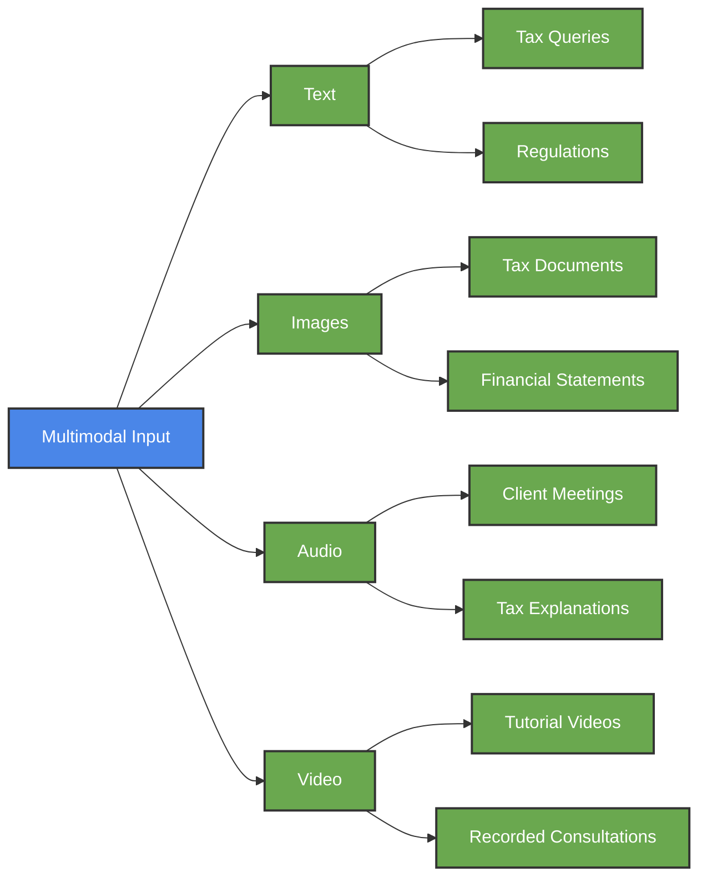
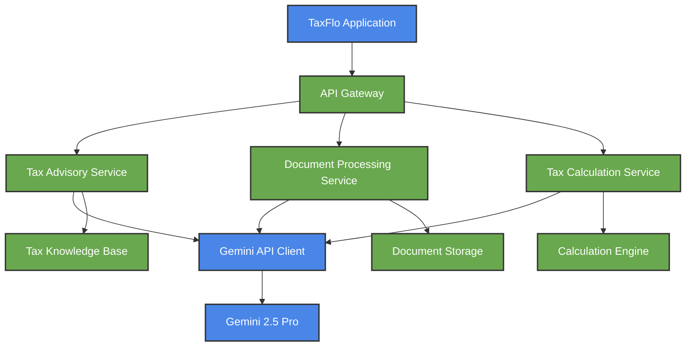

<div align="center">

# 🧠 Complete Gemini API Capabilities for TaxFlo


*Comprehensive analysis of all Gemini API features for our tax consulting platform*

</div>

## 📋 Table of Contents

- [Model Selection & Capabilities](#-model-selection--capabilities)
- [Core API Features](#-core-api-features)
- [Advanced Capabilities](#-advanced-capabilities)
- [Integration Approaches](#-integration-approaches)
- [Development Considerations](#-development-considerations)

---

## 🔍 Model Selection & Capabilities

### Gemini 2.5 Pro Models

For our TaxFlo application, we have two key Gemini 2.5 Pro models to consider:

1. **`gemini-2.5-pro-preview-03-25`** (Production Preview)
2. **`gemini-2.5-pro-exp-03-25`** (Experimental)

#### Key Capabilities of Gemini 2.5 Pro

| Capability | Supported | Notes for TaxFlo Implementation |
|------------|-----------|--------------------------------|
| Input Modalities | Audio, images, video, text | Enables processing of tax documents, recorded tax discussions, and text queries |
| Output | Text only | Good for tax advisory responses and documentation |
| Input Token Limit | 1,048,576 tokens | Can process extremely long tax documents and complex scenarios |
| Output Token Limit | 65,536 tokens | Provides detailed tax explanations and analyses |
| Structured Outputs | ✅ | Essential for structured tax data, forms, and calculations |
| Function Calling | ✅ | Enables tax calculation functions and API integrations |
| Code Execution | ✅ | Can run tax calculation code directly |
| Search Grounding | ✅ | Can ground responses in tax regulations and IRS documentation |
| Native Tool Use | ✅ | Can leverage integrated tools for enhanced tax analysis |
| Thinking | ✅ | Shows reasoning steps for complex tax scenarios |

### Alternative Models to Consider

For specific use cases or to optimize costs, these alternatives may be considered:

1. **Gemini 2.0 Flash** (`gemini-2.0-flash`)
   - Faster responses but less deep reasoning
   - Supports image generation (experimental)
   - Supports audio generation (coming soon)
   - Includes Live API support for real-time interactions

2. **Gemini 2.0 Flash Live** (`gemini-2.0-flash-live-001`)
   - Optimized for real-time audio/video interactions
   - Ideal for virtual tax consultation sessions
   - Supports audio output generation

3. **Imagen 3** (`imagen-3.0-generate-002`)
   - High-quality image generation
   - Could be used for visual explanations of tax concepts

4. **Veo 2** (`veo-2.0-generate-001`)
   - Video generation from text or images
   - Potential for creating tax explanation videos

5. **Gemini Embedding** (`gemini-embedding-exp-03-07`)
   - Text embeddings for semantic search
   - Valuable for tax document retrieval and similarity

## 💡 Core API Features

### 1. Multimodal Capabilities

The Gemini API can process and understand:



#### Implementation for TaxFlo

```javascript
// Example multimodal request with tax document and query
async function processTaxDocumentWithQuery(documentImage, query) {
  const response = await genAI.generateContent({
    model: "gemini-2.5-pro-preview-03-25",
    contents: [
      {
        role: "user",
        parts: [
          { text: "Here's a tax document and my question about it:" },
          { inlineData: { mimeType: "image/jpeg", data: documentImage } },
          { text: query }
        ]
      }
    ]
  });
  
  return response.response.text();
}
```

### 2. Structured Output Generation

Enables precise formatting of tax data and responses:

```javascript
// Structured tax calculation result schema
const taxResultSchema = {
  type: "object",
  properties: {
    taxLiability: {
      type: "number",
      description: "Total tax liability amount"
    },
    effectiveTaxRate: {
      type: "number",
      description: "Effective tax rate as a percentage"
    },
    breakdown: {
      type: "array",
      items: {
        type: "object",
        properties: {
          category: { type: "string" },
          amount: { type: "number" },
          description: { type: "string" }
        }
      }
    },
    potentialDeductions: {
      type: "array",
      items: { type: "string" }
    },
    disclaimer: { type: "string" }
  },
  required: ["taxLiability", "effectiveTaxRate", "breakdown", "disclaimer"]
};

// Usage in API call
const response = await genAI.generateContent({
  model: "gemini-2.5-pro-preview-03-25",
  contents: [{ role: "user", parts: [{ text: taxQuery }] }],
  generationConfig: {
    responseStructure: taxResultSchema
  }
});
```

### 3. Long Context Processing

Enables analysis of extensive tax documentation:

```javascript
// Processing a large tax codebase or documentation set
async function analyzeTaxRegulationChanges(oldRegulations, newRegulations) {
  const response = await genAI.generateContent({
    model: "gemini-2.5-pro-preview-03-25",
    contents: [
      {
        role: "user",
        parts: [
          { text: "Analyze the following tax regulation changes and identify key impacts:" },
          { text: "Previous regulations:\n\n" + oldRegulations },
          { text: "New regulations:\n\n" + newRegulations }
        ]
      }
    ]
  });
  
  return response.response.text();
}
```

## 🚀 Advanced Capabilities

### 1. Native Document Processing

Gemini's document processing capabilities include:

- **PDF processing**: Direct parsing of tax forms and documents
- **Document chunking**: Breaking down lengthy tax regulations
- **Form extraction**: Extracting structured data from tax forms
- **Table understanding**: Processing financial tables and schedules

```javascript
// Document processing configuration for tax forms
const taxFormConfig = {
  // Document configuration options
  chunking: {
    maxChunkSize: 4000,  // Tokens per chunk
    overlapSize: 200     // Overlap between chunks
  },
  extractionConfig: {
    headerNames: ["Gross receipts", "Cost of goods sold", "Deductions"],
    sections: ["Income", "Deductions", "Tax and Payments"],
    tableTypes: ["Balance Sheet", "Income Statement"]
  },
  processingOptions: {
    extractForms: true,
    extractTables: true,
    ocr: true
  }
};
```

### 2. Audio Processing & Generation

Audio capabilities enable conversational tax advisory:

- **Voice input processing**: Understanding spoken tax queries
- **Speech-to-text**: Transcribing tax consultations
- **Audio generation**: Generating spoken tax explanations
- **Meeting transcription**: Recording and analyzing tax meetings

```javascript
// Processing audio tax consultation
async function processTaxConsultationAudio(audioData) {
  // Process audio with tax domain optimization
  const transcription = await audioProcessor.transcribe(audioData, {
    domainHints: ["taxation", "finance", "accounting"],
    specializedVocabulary: TAX_TERMINOLOGY
  });
  
  // Generate response
  const textResponse = await getTaxAdvice(transcription.text);
  
  // Generate spoken response
  const audioResponse = await audioProcessor.generateSpeech(
    textResponse,
    { voice: "professional", speed: 1.0 }
  );
  
  return { transcription, textResponse, audioResponse };
}
```

### 3. Chain-of-Thought Reasoning (Thinking API)

Enables transparent reasoning for complex tax scenarios:

```javascript
// Generate tax advice with visible reasoning
async function getTaxAdviceWithReasoning(query, context) {
  const response = await genAI.generateContent({
    model: "gemini-2.5-pro-preview-03-25",
    contents: [{ role: "user", parts: [{ text: query }] }],
    generationConfig: {
      temperature: 0.2,
      thinking: {
        detailedThinking: true,  // Show detailed reasoning
        reasoningSteps: true,    // Break down into steps
        alternativeConsideration: true,  // Consider alternatives
        confidenceScores: true,  // Show confidence in reasoning
        citationTracking: true   // Track tax code citations
      }
    }
  });
  
  // Extract thinking and final response
  return {
    reasoning: response.thinking,
    finalAdvice: response.response.text()
  };
}
```

### 4. Grounding Capabilities

Ensures tax advice is based on verifiable sources:

```javascript
// Generate grounded tax advice
async function getGroundedTaxAdvice(query, taxYear) {
  // Get relevant tax sources
  const taxSources = await getTaxSources(query, taxYear);
  
  // Generate response grounded in these sources
  const response = await genAI.generateContent({
    model: "gemini-2.5-pro-preview-03-25",
    contents: [{ role: "user", parts: [{ text: query }] }],
    generationConfig: {
      temperature: 0.1,
      grounding: {
        sources: taxSources,
        requireCitations: true,
        strictFactChecking: true
      }
    }
  });
  
  return response.response.text();
}
```

### 5. Function Calling

Enables the model to call external functions for tax calculations:

```javascript
// Define tax calculation functions
const taxFunctions = [
  {
    name: "calculateTaxLiability",
    description: "Calculate tax liability based on income and deductions",
    parameters: {
      type: "object",
      properties: {
        income: {
          type: "number",
          description: "Total taxable income"
        },
        deductions: {
          type: "number",
          description: "Total eligible deductions"
        },
        filingStatus: {
          type: "string",
          enum: ["single", "married_joint", "married_separate", "head_of_household"],
          description: "Tax filing status"
        },
        taxYear: {
          type: "number",
          description: "Tax year for calculation"
        }
      },
      required: ["income", "filingStatus", "taxYear"]
    }
  }
];

// Implementation of the function
function calculateTaxLiability(params) {
  // Actual tax calculation logic here
  const { income, deductions, filingStatus, taxYear } = params;
  // Tax bracket lookup, calculation, etc.
  
  return {
    taxAmount: calculatedTax,
    effectiveRate: effectiveRate,
    marginalRate: marginalRate,
    // ...additional details
  };
}

// Process a tax question with function calling
async function processTaxQuestion(question) {
  const response = await genAI.generateContent({
    model: "gemini-2.5-pro-preview-03-25",
    contents: [{ role: "user", parts: [{ text: question }] }],
    tools: [{ functionDeclarations: taxFunctions }]
  });
  
  // Check if function call is required
  if (response.functionCalls && response.functionCalls.length > 0) {
    // Extract function call details
    const functionCall = response.functionCalls[0];
    const { name, args } = functionCall;
    
    // Execute the function
    let functionResult;
    if (name === "calculateTaxLiability") {
      functionResult = calculateTaxLiability(JSON.parse(args));
    }
    // Handle other functions...
    
    // Generate final response with function result
    const finalResponse = await genAI.generateContent({
      model: "gemini-2.5-pro-preview-03-25",
      contents: [
        { role: "user", parts: [{ text: question }] },
        { 
          role: "model", 
          parts: [{ functionResponse: { name, response: functionResult } }]
        }
      ]
    });
    
    return finalResponse.response.text();
  }
  
  return response.response.text();
}
```

### 6. Parallel Function Calling

Enables calling multiple tax-related functions simultaneously:

```javascript
// Process complex tax scenario with multiple functions
async function processTaxScenario(scenario) {
  const response = await genAI.generateContent({
    model: "gemini-2.5-pro-preview-03-25",
    contents: [{ role: "user", parts: [{ text: scenario }] }],
    tools: [{ functionDeclarations: [
      // Multiple tax-related functions
      {name: "calculateIncomeTax", /* ... */},
      {name: "calculateCapitalGains", /* ... */},
      {name: "identifyDeductions", /* ... */},
      {name: "assessTaxRisks", /* ... */}
    ]}]
  });
  
  // Handle multiple function calls in parallel
  if (response.functionCalls && response.functionCalls.length > 0) {
    const functionResults = await Promise.all(
      response.functionCalls.map(async call => {
        const { name, args } = call;
        // Execute appropriate function based on name
        const result = await executeTaxFunction(name, JSON.parse(args));
        return { name, response: result };
      })
    );
    
    // Generate final response with all function results
    const finalResponse = await genAI.generateContent({
      model: "gemini-2.5-pro-preview-03-25",
      contents: [
        { role: "user", parts: [{ text: scenario }] },
        { 
          role: "model", 
          parts: functionResults.map(result => ({ 
            functionResponse: result 
          }))
        }
      ]
    });
    
    return finalResponse.response.text();
  }
  
  return response.response.text();
}
```

### 7. Native Tool Use

Combines multiple built-in tools for enhanced capabilities:

```javascript
// Combine multiple tools for tax advisory
async function getTaxAdviceWithTools(query) {
  const response = await genAI.generateContent({
    model: "gemini-2.5-pro-preview-03-25",
    contents: [{ role: "user", parts: [{ text: query }] }],
    tools: [
      { 
        // Function calling for tax calculations
        functionDeclarations: TAX_FUNCTIONS 
      },
      {
        // Search grounding for tax regulations
        searchConfig: {
          query: getSearchQuery(query),
          sites: ["irs.gov", "treasury.gov", "taxfoundation.org"]
        }
      },
      {
        // Code execution for tax calculations
        codeExecution: {
          enabled: true,
          languages: ["python"]
        }
      }
    ]
  });
  
  // Process and enhance the response
  return processTaxResponseWithTools(response);
}
```

### 8. Live API for Real-time Interactions

Enables interactive tax consultations with real-time feedback:

```javascript
// Set up real-time tax consultation session
async function startTaxConsultationSession() {
  // Initialize session with Gemini Live API
  const session = await genAI.createLiveSession({
    model: "gemini-2.0-flash-live-001",
    tools: [
      { functionDeclarations: TAX_FUNCTIONS },
      { 
        searchConfig: { 
          sites: ["irs.gov", "treasury.gov"] 
        } 
      }
    ]
  });
  
  // Return session for client use
  return session;
}

// Process real-time tax query with voice
async function processLiveTaxQuery(session, audioChunk, context) {
  // Send audio chunk to the session
  const response = await session.sendContent({
    role: "user",
    parts: [
      { audio: audioChunk },
      { text: JSON.stringify(context) }
    ]
  });
  
  // Process response (may include audio response)
  return {
    text: response.text(),
    audio: response.audio(),
    functionCalls: response.functionCalls
  };
}
```

### 9. Code Execution

Enables real-time tax calculation code to be executed:

```javascript
// Execute tax calculation code
async function runTaxCalculationCode(financialData, scenario) {
  const response = await genAI.generateContent({
    model: "gemini-2.5-pro-preview-03-25",
    contents: [
      { 
        role: "user", 
        parts: [
          { 
            text: `Write and execute Python code to calculate tax liability for this scenario:
                   ${scenario}
                   
                   Financial data:
                   ${JSON.stringify(financialData, null, 2)}`
          }
        ]
      }
    ],
    tools: [{
      codeExecution: {
        enabled: true,
        languages: ["python"]
      }
    }]
  });
  
  // Extract code, execution results, and explanation
  return {
    code: extractCode(response),
    results: extractExecutionResults(response),
    explanation: extractExplanation(response)
  };
}
```

### 10. Model Context Protocol (MCP)

Enables direct control over Gemini's thinking process:

```javascript
// Direct Gemini's tax analysis process
async function guidedTaxAnalysis(taxScenario) {
  const response = await genAI.generateContent({
    model: "gemini-2.5-pro-preview-03-25",
    contents: [
      {
        role: "user",
        parts: [{ text: "Analyze this tax scenario: " + taxScenario }]
      }
    ],
    mcp: {
      "context-strategy": [
        // Guide the analysis process
        "First identify the relevant tax code sections",
        "Then determine applicable deductions and credits",
        "Consider potential audit risk factors",
        "Calculate estimated tax liability",
        "Suggest optimization strategies"
      ],
      "thinking-depth": "comprehensive",
      "citation-requirements": "high"
    }
  });
  
  return response.response.text();
}
```

### 11. Image and Video Generation

Creates visual explanations of tax concepts:

```javascript
// Generate visual tax explanation
async function generateTaxConceptVisualization(concept) {
  // Generate image using Imagen 3
  const response = await genAI.generateContent({
    model: "imagen-3.0-generate-002",
    contents: [
      { 
        role: "user", 
        parts: [
          { 
            text: `Create a clear, professional visualization explaining the tax concept of ${concept}.
                   Show it as a flowchart or diagram suitable for a tax professional presentation.
                   Use a clean, professional style with a light background.`
          }
        ]
      }
    ],
    generationConfig: {
      imageGenerationConfig: {
        aspectRatio: "16:9",
        stylePreset: "professional"
      }
    }
  });
  
  return response.images[0];
}
```

## 🔧 Integration Approaches

### API Best Practices

1. **Rate Limiting Considerations**
   - Implement exponential backoff for retries
   - Cache common tax queries to reduce API calls
   - Batch similar tax document processing requests

2. **Error Handling Strategy**
   - Implement robust error handling for API failures
   - Provide graceful fallbacks for tax calculations
   - Log detailed error information for debugging

3. **Security Best Practices**
   - Never expose API keys in client-side code
   - Implement proper authentication for tax data access
   - Encrypt sensitive tax information in transit and at rest

### Application Architecture



## 📊 Development Considerations

### Model Selection Strategy

For our TaxFlo application, we recommend the following model selection approach:

1. **Primary Model**: `gemini-2.5-pro-preview-03-25`
   - Use for all complex tax advisory, reasoning, and planning
   - Enables chain-of-thought reasoning for transparent tax advice
   - Handles long context for comprehensive tax document analysis

2. **Real-time Interactions**: `gemini-2.0-flash-live-001`
   - Use for interactive tax consultation sessions
   - Enables voice-based tax advisory
   - Provides real-time feedback during consultations

3. **Document Processing**: `gemini-2.5-pro-preview-03-25`
   - Best for complex tax document analysis
   - Handles multi-page tax forms and financial statements
   - Extracts structured data from tax documents

4. **Visual Explanations**: `imagen-3.0-generate-002`
   - Generate visualizations of tax concepts
   - Create custom tax planning diagrams
   - Visualize tax strategies for presentations

### Cost Optimization

To optimize API usage costs:

1. **Caching Strategy**
   - Cache common tax queries and responses
   - Implement tiered caching based on query complexity
   - Store generated tax visualizations for reuse

2. **Context Optimization**
   - Only include relevant tax context in queries
   - Filter out unnecessary information from tax documents
   - Use chunking for large documents to process only relevant sections

3. **Token Usage Monitoring**
   - Implement token counting for all API requests
   - Set usage alerts and limits
   - Optimize prompts to reduce token consumption

### Testing & Evaluation

Comprehensive testing should include:

1. **Accuracy Testing**
   - Validate tax calculations against known examples
   - Compare advice to authoritative tax sources
   - Test with historical tax scenarios

2. **Performance Testing**
   - Measure response times for different query types
   - Test document processing with various tax form types
   - Evaluate real-time interaction latency

3. **User Experience Testing**
   - Test with tax professionals for accuracy review
   - Evaluate client understanding of tax explanations
   - Measure satisfaction with interactive tax sessions

## 🔮 Future Capabilities

Based on the Gemini API roadmap, these capabilities may become available:

1. **Enhanced Audio Generation**
   - More natural-sounding tax explanations
   - Wider range of voices and speaking styles
   - Multilingual tax advisory capabilities

2. **Improved Image Generation**
   - Higher quality tax concept visualizations
   - More customizable visual styles
   - Animation capabilities for tax education

3. **Advanced Tool Use**
   - More seamless integration with external tax tools
   - Enhanced real-time data processing
   - Expanded native tool capabilities

4. **Model Improvements**
   - Continued improvements in tax knowledge accuracy
   - Better handling of complex tax scenarios
   - More efficient processing of tax documentation

By implementing these comprehensive Gemini API capabilities, TaxFlo will deliver a state-of-the-art AI-powered tax consulting experience that combines deep tax expertise with cutting-edge AI technology.
