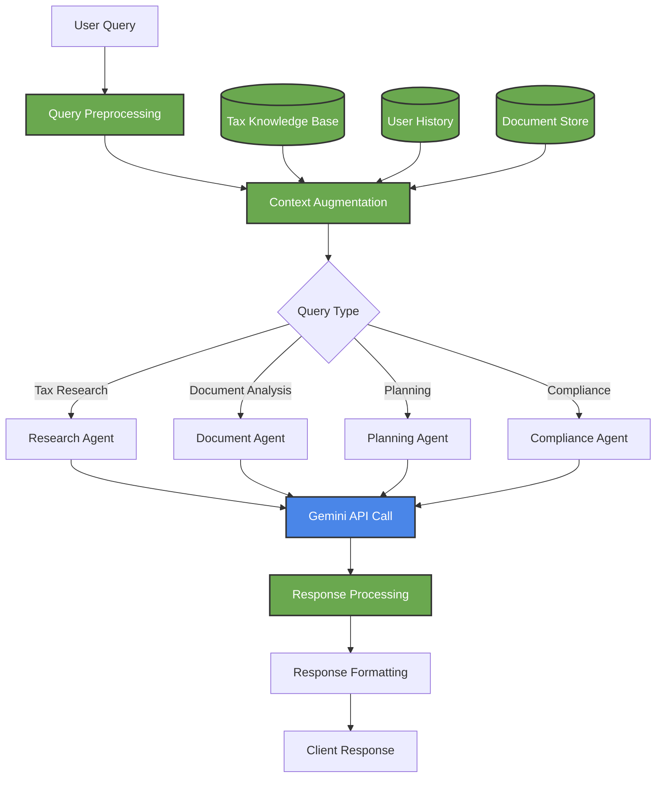
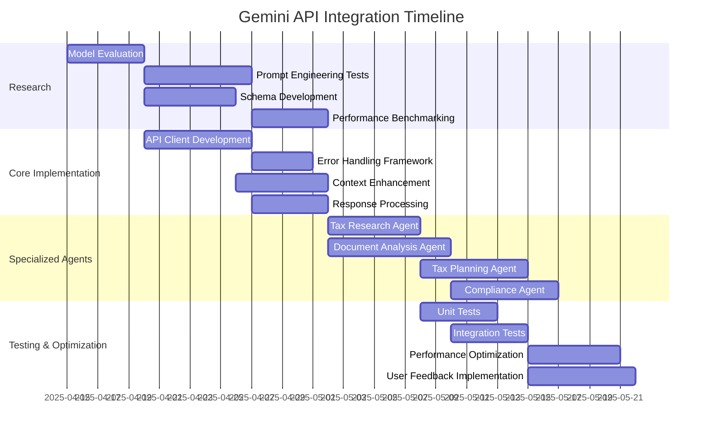

<div align="center">

# 🧠 Gemini API Integration Plan


*Leveraging Gemini 2.5 Pro for AI-powered tax consulting*

</div>

## 1. Model Selection Analysis

### `gemini-2.5-pro-preview-03-25` vs `gemini-2.5-pro-exp-03-25`

| Feature | gemini-2.5-pro-preview-03-25 | gemini-2.5-pro-exp-03-25 | Recommendation |
|---------|------------------------------|--------------------------|----------------|
| Context window | Up to 1M tokens | Up to 1M tokens | Both suitable for complex tax contexts |
| Multi-modal capabilities | Strong | Experimental enhancements | Test both on tax document analysis |
| Reasoning capabilities | Strong | Potentially enhanced | Critical for tax interpretation |
| Structured output | Supported | Supported with enhancements | Test output quality for tax data |
| Function calling | Supported | Supported with enhancements | Important for tax calculations |
| Cost | Standard pricing | Potential premium | Consider for MVP budget |

**Initial Selection**: We'll conduct comparative testing with both models on tax-specific scenarios to determine the optimal choice for our MVP.

## 2. API Integration Architecture



## 3. Core API Functions

### 3.1 Tax Advisory Function

```javascript
/**
 * Provides tax advisory responses using Gemini
 * @param {string} query - User's tax question
 * @param {object} userContext - User profile and history
 * @param {object} taxContext - Relevant tax knowledge
 * @returns {object} Formatted advisory response
 */
async function getTaxAdvisory(query, userContext, taxContext) {
  // Construct prompt with tax-specific context
  const systemInstruction = TAX_ADVISORY_PROMPT;
  
  // Enhance query with context
  const enhancedQuery = enhanceQueryWithContext(query, userContext, taxContext);
  
  // Call Gemini API
  const response = await googleAI.generateContent({
    model: "gemini-2.5-pro-preview-03-25",
    systemInstruction,
    contents: [{ role: "user", parts: [{ text: enhancedQuery }] }],
    generationConfig: {
      temperature: 0.2,  // Lower for more precise tax advice
      topP: 0.8,
      topK: 40,
      responseStructure: TAX_ADVISORY_SCHEMA
    },
    safetySettings: SAFETY_SETTINGS
  });
  
  // Process and format response
  return processTaxAdvisoryResponse(response);
}
```

### 3.2 Document Analysis Function

```javascript
/**
 * Analyzes tax documents using Gemini's multimodal capabilities
 * @param {Buffer} documentImage - The document image/PDF
 * @param {string} documentType - Type of tax document
 * @returns {object} Extracted tax information
 */
async function analyzeTaxDocument(documentImage, documentType) {
  // Construct document-specific prompt
  const systemInstruction = getDocumentAnalysisPrompt(documentType);
  
  // Call Gemini API with document image
  const response = await googleAI.generateContent({
    model: "gemini-2.5-pro-preview-03-25",
    systemInstruction,
    contents: [
      { 
        role: "user", 
        parts: [
          { text: `Please analyze this ${documentType} and extract all relevant tax information:` },
          { inlineData: { mimeType: "image/jpeg", data: documentImage } }
        ] 
      }
    ],
    generationConfig: {
      temperature: 0.1,  // Very low for factual extraction
      responseStructure: getTaxDocumentSchema(documentType)
    }
  });
  
  // Process and validate extracted information
  return validateTaxDocumentData(
    processTaxDocumentResponse(response),
    documentType
  );
}
```

### 3.3 Tax Planning Function

```javascript
/**
 * Generates tax planning scenarios using Gemini
 * @param {object} financialData - User's financial information
 * @param {object} objectives - Tax planning objectives
 * @param {array} constraints - Limitations and requirements
 * @returns {object} Tax planning scenarios and recommendations
 */
async function generateTaxPlan(financialData, objectives, constraints) {
  // Construct tax planning prompt
  const systemInstruction = TAX_PLANNING_PROMPT;
  
  // Prepare planning context
  const planningContext = prepareTaxPlanningContext(
    financialData, 
    objectives, 
    constraints
  );
  
  // Call Gemini API
  const response = await googleAI.generateContent({
    model: "gemini-2.5-pro-preview-03-25",
    systemInstruction,
    contents: [
      { 
        role: "user", 
        parts: [{ text: planningContext }] 
      }
    ],
    generationConfig: {
      temperature: 0.3,  // Balanced for creativity and precision
      responseStructure: TAX_PLANNING_SCHEMA
    }
  });
  
  // Process and enhance planning response
  return enhanceTaxPlanWithCalculations(
    processTaxPlanResponse(response)
  );
}
```

## 4. Prompt Engineering Strategy

### 4.1 System Instruction Templates

```javascript
// Core tax advisory prompt
const TAX_ADVISORY_PROMPT = `
You are TaxFlo, an AI tax consultant specializing in corporate taxation.

YOUR ROLE:
- Provide clear, accurate tax guidance based on current regulations
- Prioritize factual, actionable information backed by specific tax code references
- Maintain a professional, informative tone appropriate for corporate tax advisory

IMPORTANT GUIDELINES:
- Always cite specific tax code sections when referencing regulations
- Express appropriate uncertainty when tax positions are not clear-cut
- Present multiple approaches where relevant with pros/cons
- Ask clarifying questions when information is insufficient
- Avoid overly aggressive tax positions or gray areas
- Include relevant deadlines, filing requirements, and compliance considerations
- Format responses clearly with headings, bullet points, and concise explanations

YOUR RESPONSE STRUCTURE:
1. Summary of advice (2-3 sentences)
2. Detailed explanation with tax code references
3. Action steps or considerations
4. Limitations of advice and disclaimer

You have access to tax regulations current as of April 2025.
`;

// Document analysis prompt template
function getDocumentAnalysisPrompt(documentType) {
  const documentPrompts = {
    "Form 1120": `
      Analyze this corporate tax return (Form 1120) and extract all key information.
      Focus on:
      - Identifying information (EIN, tax year, company name)
      - Income details (gross receipts, costs, total income)
      - Deduction information (salaries, repairs, bad debts, taxes, interest)
      - Tax calculations (taxable income, credits, payments, refund/amount owed)
      - Schedule information if present
      
      Return data in a structured format matching the form sections.
      If any field is unclear or potentially incorrect, indicate this.
    `,
    // Additional document types would be defined here
  };
  
  return documentPrompts[documentType] || DEFAULT_DOCUMENT_PROMPT;
}
```

### 4.2 Response Schemas

```javascript
// Tax advisory schema
const TAX_ADVISORY_SCHEMA = {
  type: "object",
  properties: {
    summary: {
      type: "string",
      description: "Brief summary of the tax advice (2-3 sentences)"
    },
    explanation: {
      type: "string",
      description: "Detailed explanation with tax code references"
    },
    actionItems: {
      type: "array",
      items: {
        type: "string"
      },
      description: "Specific actions the user should consider"
    },
    taxCodeReferences: {
      type: "array",
      items: {
        type: "object",
        properties: {
          code: { type: "string" },
          description: { type: "string" }
        }
      },
      description: "Relevant tax code sections referenced"
    },
    disclaimer: {
      type: "string",
      description: "Limitations of the advice provided"
    }
  },
  required: ["summary", "explanation", "disclaimer"]
};

// Dynamic document schema generator
function getTaxDocumentSchema(documentType) {
  // Different schemas for different tax document types
  const documentSchemas = {
    "Form 1120": {
      type: "object",
      properties: {
        identifyingInfo: {
          type: "object",
          properties: {
            ein: { type: "string" },
            companyName: { type: "string" },
            taxYear: { type: "string" },
            address: { type: "string" }
          }
        },
        incomeInfo: {
          type: "object",
          properties: {
            grossReceipts: { type: "number" },
            costOfGoodsSold: { type: "number" },
            grossProfit: { type: "number" },
            totalIncome: { type: "number" }
            // Additional fields...
          }
        },
        // Additional sections...
      }
    },
    // Other document types...
  };
  
  return documentSchemas[documentType] || DEFAULT_DOCUMENT_SCHEMA;
}
```

## 5. Error Handling & Fallbacks

```javascript
/**
 * Handles errors in Gemini API responses
 * @param {Error} error - The error object
 * @param {string} queryType - Type of query that failed
 * @param {object} context - Additional context
 * @returns {object} Fallback response or error details
 */
function handleGeminiError(error, queryType, context) {
  // Log detailed error information
  logger.error(`Gemini API error for ${queryType}:`, {
    error: error.message,
    stack: error.stack,
    context
  });
  
  // Handle different error types
  if (error.code === 'RESOURCE_EXHAUSTED') {
    // Rate limit exceeded
    return {
      status: 'error',
      message: 'Our tax advisory service is experiencing high demand. Please try again shortly.',
      fallbackResponse: getFallbackResponse(queryType, context)
    };
  } else if (error.code === 'INVALID_ARGUMENT') {
    // Input validation issue
    return {
      status: 'error',
      message: 'There was an issue with your tax query. Please revise and try again.',
      validationHints: getValidationHints(error, queryType)
    };
  } else if (error.code === 'DEADLINE_EXCEEDED') {
    // Timeout
    return {
      status: 'error',
      message: 'Your complex tax query is taking longer than expected to process.',
      fallbackResponse: getSimplifiedFallbackResponse(queryType, context)
    };
  }
  
  // Generic error handling
  return {
    status: 'error',
    message: 'We encountered an issue processing your tax query. Our team has been notified.',
    errorId: generateErrorId(),
    userAction: getSuggestedUserAction(queryType, error)
  };
}
```

## 6. Context Enhancement

```javascript
/**
 * Enhances user queries with relevant context
 * @param {string} query - Original user query
 * @param {object} userContext - User profile and history
 * @param {object} taxContext - Relevant tax knowledge
 * @returns {string} Enhanced query with context
 */
function enhanceQueryWithContext(query, userContext, taxContext) {
  // Extract relevant user information
  const {
    industryType,
    entityType,
    jurisdictions,
    priorInteractions
  } = userContext;
  
  // Get relevant tax regulations
  const relevantRegulations = getTaxRegulationsForContext(
    taxContext,
    entityType,
    jurisdictions
  );
  
  // Format prior interactions
  const recentInteractions = formatRecentInteractions(
    priorInteractions,
    5 // Limit to 5 most recent relevant interactions
  );
  
  // Build enhanced context
  return `
QUERY: ${query}

USER CONTEXT:
- Industry: ${industryType}
- Entity Type: ${entityType}
- Jurisdictions: ${jurisdictions.join(', ')}

RELEVANT PRIOR INTERACTIONS:
${recentInteractions}

RELEVANT TAX REGULATIONS:
${relevantRegulations}

Please provide tax guidance based on the above context.
  `;
}
```

## 7. Implementation Timeline



## 8. Testing Strategy

### 8.1 Test Cases

| Category | Test Case | Description | Expected Outcome |
|----------|-----------|-------------|------------------|
| **Basic Functionality** | Simple tax question | "What is the corporate tax rate for 2025?" | Accurate response with current rates and relevant code sections |
| **Reasoning** | Complex scenario | "How does depreciation recapture affect asset sales?" | Explanation of recapture rules with examples and code references |
| **Document Analysis** | Form 1120 processing | Upload of sample Form 1120 | Accurate extraction of key financial data |
| **Tax Planning** | Scenario evaluation | Generate tax strategies for expansion scenario | Multiple valid strategies with pros/cons |
| **Error Handling** | Ambiguous query | "What about taxes?" | Clarifying questions to narrow focus |
| **Limitations** | Out-of-scope query | "Draft a legal contract" | Clear indication this is beyond tax advisory scope |
| **Context Utilization** | Follow-up question | "What about for S-Corps?" after entity question | Proper maintenance of conversation context |
| **Disclaimer Inclusion** | Any tax advice | Any substantive tax guidance | Clear disclaimer about consulting professionals |

### 8.2 Evaluation Metrics

- **Accuracy**: Correctness of tax information (evaluated by tax professionals)
- **Relevance**: Appropriateness to the query and user context
- **Comprehensiveness**: Inclusion of necessary details and considerations
- **Citation Quality**: Accuracy and specificity of tax code references
- **Response Time**: Latency for different query complexities
- **Fallback Effectiveness**: Quality of responses during API issues

## 9. Key Implementation Challenges

1. **Tax Knowledge Recency**: Ensuring the model has access to current tax regulations
2. **Jurisdiction Handling**: Managing multi-jurisdiction tax questions
3. **Document Quality Variation**: Handling diverse quality of uploaded tax documents
4. **Prompt Optimization**: Finding the optimal prompts for tax-specific reasoning
5. **Confidence Indicators**: Developing accurate confidence metrics for tax advice
6. **Reasonable Response Time**: Balancing comprehensive answers with acceptable latency
7. **Handling Specialized Terminology**: Ensuring correct interpretation of tax jargon
8. **Compliance Boundaries**: Clearly delineating advisory vs. definitive tax guidance

## 10. Evaluation & Refinement Plan

1. **Tax Expert Review**: Regular review of responses by tax professionals
2. **Performance Monitoring**: Tracking response quality, latency, and error rates
3. **Prompt Iteration**: Continuous refinement of prompts based on performance
4. **User Feedback Loop**: Incorporating user feedback on response quality
5. **A/B Testing**: Testing different prompt strategies for optimal results
6. **Error Analysis**: Regular review of failure cases for improvement
7. **Knowledge Enhancement**: Developing methods to supplement model knowledge with current tax data
