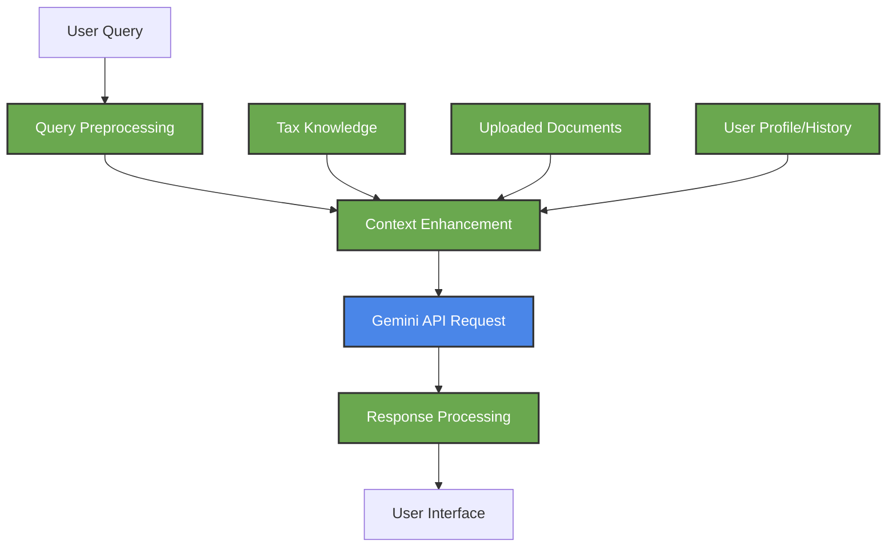
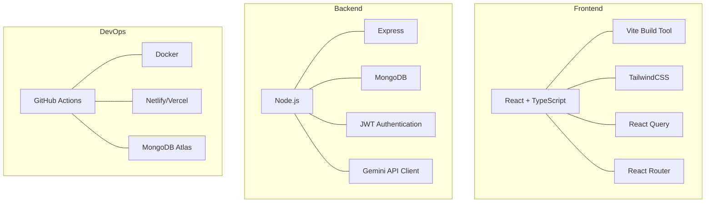
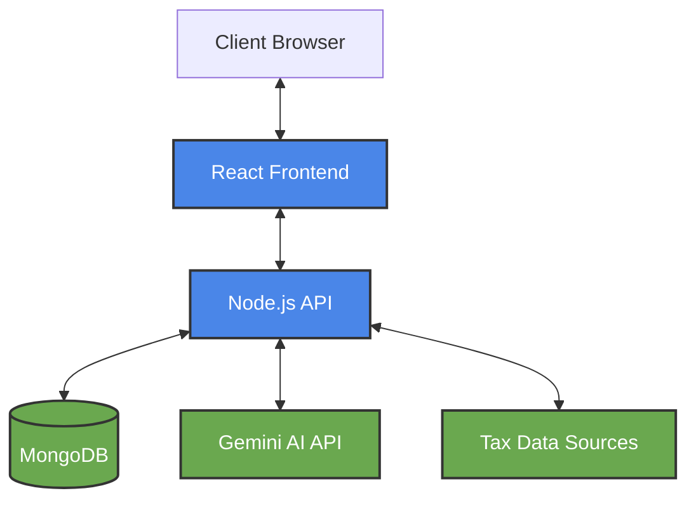
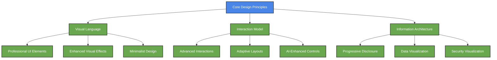
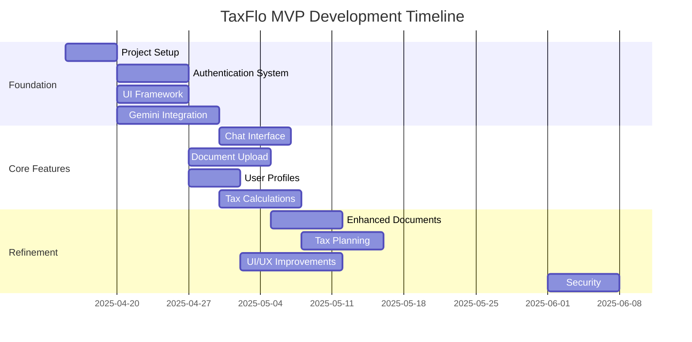

<div align="center">

# 🚀 TaxFlo MVP Development Plan


*Building the core tax consulting experience with Gemini 2.5 Pro*

</div>

<details>
<summary><b>📗 Table of Contents</b></summary>

- [🎯 MVP Scope](#-mvp-scope)
- [🧠 Gemini Integration](#-gemini-integration)
- [🏗️ Technical Architecture](#-technical-architecture)
- [⚙️ Development Workflow](#-development-workflow)
- [📋 Feature Roadmap](#-feature-roadmap)
- [🔍 Testing Strategy](#-testing-strategy)
- [🚀 Deployment Plan](#-deployment-plan)
</details>

---

## 🎯 MVP Scope

> "Focus creates excellence. Our MVP will deliver core value through targeted functionality."

The TaxFlo MVP will focus on delivering a streamlined corporate tax advisory experience powered by Gemini 2.5 Pro. We'll build the foundation for our AI-powered tax consulting platform with these key capabilities:

### Core MVP Features

1. **Tax Advisory Agent**: An AI assistant that can answer tax-related questions, interpret regulations, and provide guidance
2. **Document Analysis**: Upload and process tax documents for key information extraction
3. **Basic Tax Planning**: Simple scenario modeling for tax liability estimation
4. **User Management**: Authentication and basic profile management
5. **Secure Chat Interface**: Chat-based interaction with our tax agents

### MVP Limitations

For the MVP phase, the following capabilities will be deferred:

- Advanced multi-jurisdiction tax handling
- Complex corporate structure optimization
- Full automation of tax form preparation
- Enterprise-level integrations with ERP systems
- Comprehensive audit defense capabilities

## 🧠 Gemini Integration

> "Gemini 2.5 Pro provides the intelligence layer for our tax advisory platform."

We'll leverage Google's Gemini 2.5 Pro (model: `gemini-2.5-pro-preview-03-25`) through the Google AI API to power our core tax intelligence capabilities. This large language model will enable:

### Gemini Implementation Strategy



### Key Gemini API Features

1. **Structured Output**: We'll use the structured output feature to ensure consistent, parseable responses for tax advisory content
2. **Function Calling**: Enabling the model to call specific tax calculation functions when needed
3. **Multi-Modal Input**: Processing both text queries and tax document images
4. **System Instructions**: Providing specialized tax expertise through carefully crafted system prompts
5. **Request Safety**: Implementing content filtering to ensure compliant tax advice

### Gemini Prompt Engineering

Creating effective prompts will be critical for tax domain expertise:

```javascript
// Example system prompt for tax advisory
const systemPrompt = `You are TaxFlo, an AI tax advisor specializing in corporate taxation.
- Always base advice on current tax regulations and cite specific sections
- Disclose uncertainty when a tax position is ambiguous
- Ask clarifying questions when information is incomplete
- Remain neutral on aggressive tax strategies
- Present multiple options when appropriate
- Format responses consistently using the specified structure
- Never provide definitive legal advice without human review`;
```

## 🏗️ Technical Architecture

> "A modern, scalable architecture built on React, Vite, and Node.js."

The TaxFlo MVP will use a clean architecture with clear separation of concerns:

### Technology Stack



### System Architecture



### Folder Structure

```
taxflo-app/
├── client/                   # Frontend React application
│   ├── public/               # Static assets
│   ├── src/
│   │   ├── assets/           # Images, fonts, etc.
│   │   ├── components/       # Reusable UI components
│   │   ├── contexts/         # React contexts (auth, etc.)
│   │   ├── features/         # Feature-specific components
│   │   │   ├── auth/         # Authentication components
│   │   │   ├── chat/         # Chat interface components
│   │   │   ├── documents/    # Document processing components
│   │   │   └── taxPlanning/  # Tax planning components
│   │   ├── hooks/            # Custom React hooks
│   │   ├── services/         # API service clients
│   │   ├── types/            # TypeScript type definitions
│   │   ├── utils/            # Utility functions
│   │   ├── App.tsx           # Main application component
│   │   └── main.tsx          # Application entry point
│   ├── index.html            # HTML template
│   ├── tailwind.config.js    # TailwindCSS configuration
│   ├── tsconfig.json         # TypeScript configuration
│   └── vite.config.ts        # Vite configuration
│
├── server/                   # Backend Node.js application
│   ├── src/
│   │   ├── config/           # Configuration files
│   │   ├── controllers/      # Request handlers
│   │   ├── middleware/       # Express middleware
│   │   ├── models/           # MongoDB schemas
│   │   ├── routes/           # API routes
│   │   ├── services/         # Business logic
│   │   │   ├── gemini/       # Gemini API integration
│   │   │   ├── tax/          # Tax calculation services
│   │   │   └── documents/    # Document processing
│   │   ├── types/            # TypeScript type definitions
│   │   ├── utils/            # Utility functions
│   │   └── app.ts            # Express application
│   ├── tsconfig.json         # TypeScript configuration
│   └── package.json          # Node.js dependencies
│
├── shared/                   # Shared code between client and server
│   ├── types/                # Shared TypeScript definitions
│   └── utils/                # Shared utility functions
│
├── docker-compose.yml        # Docker configuration
├── .github/                  # GitHub workflows
├── .gitignore                # Git ignore file
└── README.md                 # Project documentation
```

## 🎨 UI/UX Design Approach

> "A sophisticated, trustworthy interface for complex tax advisory."

The TaxFlo user interface will follow 2025's cutting-edge financial application design trends while maintaining professional credibility. Our design principles prioritize clarity, trust, and ease of use for tax professionals and business users.

### 2025 Design Trends Implementation



### Key Design Elements (2025)

1. **Sophisticated UI Components**
   - Translucent panels with layered visual hierarchy for tax data
   - Window and shadow overlays creating natural depth for financial interfaces
   - Dimensional cards with subtle shadows mimicking physical tax documents
   - Professional color palette of deep blues (#2C5282) with accent greens (#38A169)

2. **Strategic Visual Effects**
   - Subtle glow effects highlighting critical tax deadlines and action items
   - Light bloom techniques emphasizing key financial controls and data points
   - High-contrast visual indicators for tax compliance status
   - Animated micro-interactions providing feedback on tax calculations

3. **Financial UX Innovations**
   - Progressive disclosure of complex tax concepts through expandable sections
   - Interactive progress indicators for multi-step tax workflows
   - Personalized dashboards adapting to user's tax situation and history
   - Visual security indicators communicating data protection measures

4. **Accessibility-First Design**
   - WCAG 2.2 AA compliance ensuring all users can access tax information
   - High-contrast viewing options for financial data visualization
   - Keyboard navigation optimized for tax professionals
   - Screen reader compatibility for all critical tax information

5. **Advanced Interaction Models**
   - Sophisticated scroll animations revealing tax data progressively
   - Adaptive layouts showing simplified views on mobile, comprehensive data on desktop
   - AI-powered smart suggestions based on tax context
   - Subtle haptic feedback for mobile users completing tax workflows

### UI Component Library

We'll create a custom TaxFlo design system with these core components:

```javascript
// Example UI component structure
const UIComponents = {
  // Layout components
  LayoutComponents: [
    'DashboardLayout',      // Main application layout
    'SidePanel',            // Collapsible information panel
    'ContentCard',          // Card with subtle shadows and depth
    'TranslucentOverlay',   // Semi-transparent information overlay
  ],
  
  // Data visualization
  DataComponents: [
    'TaxLiabilityChart',    // Visual tax calculation display
    'ComplianceTimeline',   // Timeline of tax deadlines
    'DocumentPreview',      // Tax document visualization
    'ScenarioComparison',   // Side-by-side tax scenario display
  ],
  
  // Interactive elements
  InteractiveComponents: [
    'GlowButton',           // Action button with subtle highlight
    'ProgressStepper',      // Multi-step tax process indicator
    'ScrollRevealSection',  // Content revealed through scroll
    'AnimatedDataPoint',    // Numbers with counting animation
  ],
  
  // AI interface elements
  AIComponents: [
    'ChatBubble',           // Sophisticated message container
    'ThinkingIndicator',    // AI processing visualization
    'SmartSuggestion',      // Contextual response options
    'CitationBlock',        // Tax code reference display
  ]
};
```

### Responsive Design Strategy

TaxFlo will adapt elegantly across device sizes with these breakpoints:

- **Desktop (>1200px)**: Full-featured interface with multi-column layouts
- **Tablet (768px-1199px)**: Adapted layouts with collapsed secondary features
- **Mobile (<767px)**: Essential-focused interface with prioritized tax workflows

All screens will maintain professional aesthetics with appropriately sized touch targets (minimum 44x44px) for mobile users and optimized keyboard interactions for desktop tax professionals.

## ⚙️ Development Workflow

> "Efficient development practices ensure quality and consistency."

### Development Approach


### Environment Setup

1. **Local Development**
   - Node.js v18+
   - npm/yarn
   - MongoDB local instance
   - Google AI API key
   
2. **Environment Variables**
   ```
   # Frontend (.env)
   VITE_API_URL=http://localhost:5000
   VITE_GEMINI_API_KEY=your-api-key
   
   # Backend (.env)
   PORT=5000
   MONGODB_URI=mongodb://localhost:27017/taxflo
   JWT_SECRET=your-secret-key
   GEMINI_API_KEY=your-api-key
   ```

3. **Getting Started Commands**
   ```bash
   # Frontend
   cd client
   npm install
   npm run dev
   
   # Backend
   cd server
   npm install
   npm run dev
   ```

## 📋 Feature Roadmap

> "Our MVP development follows a clear, prioritized path to delivery."

### Phase 1: Foundation (Weeks 1-2)

- Project setup and architecture
- Authentication system
- Basic UI framework
- Gemini API integration
- API scaffolding

### Phase 2: Core Features (Weeks 3-5)

- Chat interface for tax advisory
- Basic document upload and analysis
- User profile management
- Simple tax calculation capabilities
- Tax knowledge base integration

### Phase 3: Refinement (Weeks 6-8)

- Enhanced document analysis
- Basic tax planning scenarios
- UI/UX improvements
- Performance optimization
- Security enhancements

### Feature Development Gantt Chart



## 🔍 Testing Strategy

> "Comprehensive testing ensures our tax advisory platform functions reliably and accurately."

### Testing Approach

1. **Unit Testing**
   - Frontend: Jest + React Testing Library
   - Backend: Jest
   - Coverage target: 80%+ for critical tax logic

2. **Integration Testing**
   - API endpoint tests
   - Gemini API integration tests
   - Database operation tests

3. **UI Testing**
   - Component testing
   - User flow testing
   - Accessibility testing

4. **Tax Logic Testing**
   - Validation against known tax scenarios
   - Edge case testing for tax calculations
   - Regulatory compliance verification

5. **Performance Testing**
   - API response time
   - UI rendering performance
   - Gemini API latency management

## 🚀 Deployment Plan

> "Smooth deployment processes ensure reliable delivery to our users."

### Deployment Strategy

1. **Environments**
   - Development: Local development
   - Staging: Preview deployments
   - Production: Live environment

2. **Frontend Deployment**
   - Hosting: Vercel or Netlify
   - CI/CD: GitHub Actions
   - Build process: `npm run build`

3. **Backend Deployment**
   - Hosting: Render, Railway, or AWS
   - Container: Docker
   - Database: MongoDB Atlas

4. **Monitoring**
   - Application: Sentry
   - Performance: Lighthouse
   - Usage analytics: Google Analytics

### Launch Checklist

- [ ] Security audit
- [ ] Performance optimization
- [ ] Accessibility compliance
- [ ] Browser compatibility
- [ ] Mobile responsiveness
- [ ] Documentation
- [ ] Backup and recovery plan
- [ ] Monitoring setup
- [ ] Scaling strategy

---

## Gemini 2.5 Pro Implementation Details

### Model Selection

We'll use the `gemini-2.5-pro-preview-03-25` model for our MVP, which offers the following advantages:

- Advanced reasoning capabilities for complex tax scenarios
- Improved context handling (up to 1 million tokens)
- Better multi-modal capabilities for document analysis
- Enhanced instruction following for tax-specific prompts

### Key Integration Points

#### 1. Tax Research Agent

```javascript
// Example code for tax research queries
async function getTaxGuidance(query, context) {
  const geminiResponse = await genAI.generateContent({
    model: "gemini-2.5-pro-preview-03-25",
    systemInstruction: SYSTEM_INSTRUCTIONS.TAX_RESEARCH,
    contents: [
      {
        role: "user",
        parts: [
          { text: `Query: ${query}\nContext: ${JSON.stringify(context)}` }
        ]
      }
    ],
    generationConfig: {
      temperature: 0.2,
      topP: 0.8,
      topK: 40
    },
    safetySettings: SAFETY_SETTINGS
  });
  
  return processGeminiResponse(geminiResponse);
}
```

#### 2. Document Analysis

```javascript
// Example code for document analysis
async function analyzeTaxDocument(documentImage, documentType) {
  const geminiResponse = await genAI.generateContent({
    model: "gemini-2.5-pro-preview-03-25",
    systemInstruction: SYSTEM_INSTRUCTIONS.DOCUMENT_ANALYSIS,
    contents: [
      {
        role: "user",
        parts: [
          { text: `Extract key tax information from this ${documentType} document:` },
          { inlineData: { mimeType: "image/jpeg", data: documentImage } }
        ]
      }
    ],
    generationConfig: {
      temperature: 0.1,
      responseStructure: {
        type: "TAX_DOCUMENT_ANALYSIS",
        format: "JSON"
      }
    }
  });
  
  return processDocumentAnalysis(geminiResponse);
}
```

#### 3. Structured Output for Tax Planning

```javascript
// Example structured output definition
const taxPlanningStructure = {
  type: "object",
  properties: {
    scenarios: {
      type: "array",
      items: {
        type: "object",
        properties: {
          name: { type: "string" },
          description: { type: "string" },
          taxLiability: { type: "number" },
          riskLevel: { 
            type: "string",
            enum: ["Low", "Medium", "High"]
          },
          recommendations: {
            type: "array",
            items: { type: "string" }
          },
          regulatoryConsiderations: {
            type: "array",
            items: { type: "string" }
          }
        },
        required: ["name", "taxLiability", "riskLevel", "recommendations"]
      }
    },
    summary: { type: "string" },
    disclaimer: { type: "string" }
  },
  required: ["scenarios", "summary", "disclaimer"]
};
```

The TaxFlo MVP will leverage these Gemini capabilities to deliver a powerful yet focused tax advisory experience that forms the foundation for our more comprehensive platform vision.
