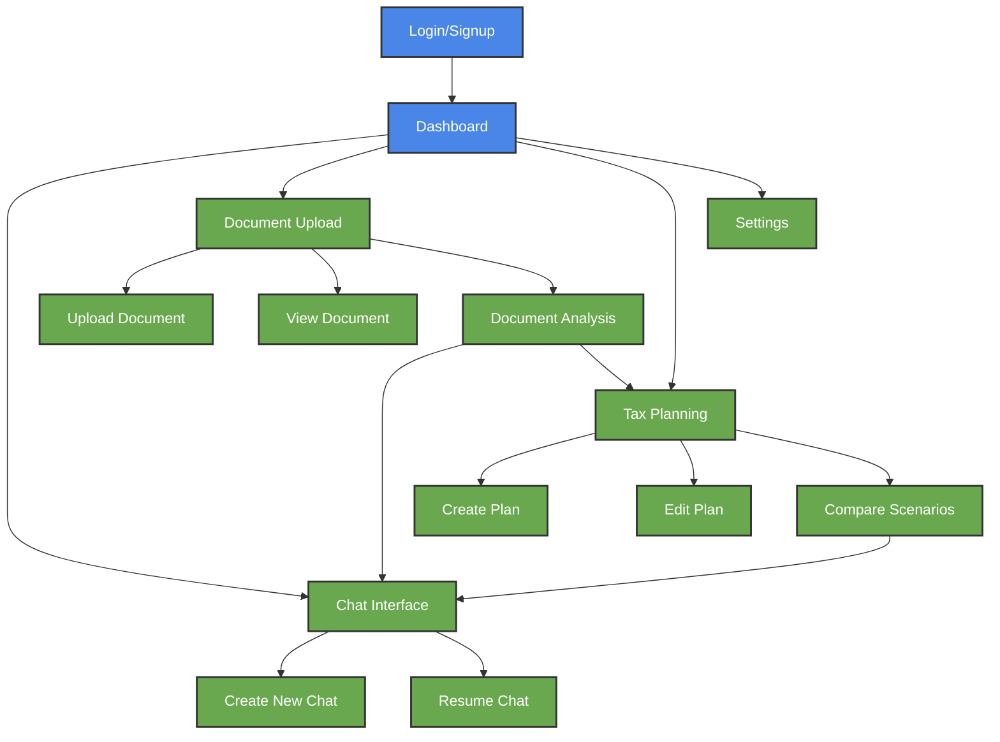

<div align="center">

# 🎨 TaxFlo UI/UX Design Guide


*A professional, intuitive interface for AI-powered tax advisory*

</div>

## 📋 Table of Contents

- [Design Principles](#-design-principles)
- [Main Dashboard](#-main-dashboard)
- [Key Pages](#-key-pages)
- [Navigation Flow](#-navigation-flow)
- [UI Components](#-ui-components)
- [Responsive Design](#-responsive-design)

---

## 🎯 Design Principles

TaxFlo's interface should communicate trustworthiness, expertise, and clarity while making complex tax concepts accessible. Our design adheres to these principles:

1. **Professional & Trustworthy**: Clean, structured layouts with a color palette conveying reliability and authority
2. **Intuitive Navigation**: Clear information hierarchy and consistent navigation
3. **Focused Interactions**: Minimizing cognitive load during tax conversations and document analysis
4. **Progressive Disclosure**: Revealing complex tax details gradually as needed
5. **Data Visualization**: Making tax data and insights visually comprehensible
6. **Accessibility**: Meeting WCAG standards for all users
7. **Responsive Design**: Seamless experience across devices

## 🏠 Main Dashboard

The dashboard serves as the central hub for all tax activities, offering an at-a-glance view of the user's tax status and quick access to key features.

### Dashboard Layout

```
+----------------------------------------------------------------------+
|                                                                      |
| [LOGO] TaxFlo                                       [Profile] [Help] |
|                                                                      |
+----------------------------------------------------------------------+
|                                                                      |
| [Sidebar Nav]|                  DASHBOARD                            |
|              |                                                       |
| ○ Dashboard  |  +----------------+  +-------------------------+      |
| ○ Chat       |  |                |  |                         |      |
| ○ Documents  |  | Welcome back,  |  | Tax Planning Summary    |      |
| ○ Tax Plans  |  | [User Name]    |  | ◉ Current Tax Status   |      |
| ○ Settings   |  |                |  | ◉ Estimated Liability  |      |
|              |  | [Quick Actions]|  | ◉ Potential Savings    |      |
|              |  |                |  |                         |      |
|              |  +----------------+  +-------------------------+      |
|              |                                                       |
|              |  +----------------+  +-------------------------+      |
|              |  |                |  |                         |      |
|              |  | Recent Chats   |  | Document Analysis       |      |
|              |  | ○ Tax Planning |  | ✓ Last W-2 processed   |      |
|              |  | ○ Deductions   |  | ✓ 1099 analyzed        |      |
|              |  | ○ Q2 Est. Tax  |  | □ Upload new document  |      |
|              |  |                |  |                         |      |
|              |  +----------------+  +-------------------------+      |
|              |                                                       |
+----------------------------------------------------------------------+
```

### Dashboard Components

1. **Welcome & Quick Actions**
   - Personalized greeting
   - Quick action buttons for common tasks: "New Chat", "Upload Document", "Create Tax Plan"
   - Recent activity timeline

2. **Tax Planning Summary**
   - Current tax status visualization (color-coded)
   - Estimated liability calculator
   - Potential savings opportunities
   - Year-to-date tax visualization

3. **Recent Chats**
   - List of 3-5 most recent tax advisory conversations
   - Topic indicators and timestamps
   - Quick resume option for ongoing conversations

4. **Document Analysis**
   - Status of recently processed tax documents
   - Key insights extracted from documents
   - Upload new document button
   - Document completion tracker

5. **Compliance Calendar**
   - Timeline visualization of upcoming tax deadlines
   - Reminder settings
   - Completion status indicators

### Dashboard Visual Design

- **Color Scheme**: Professional blues (primary: #2C5282) with accent colors for status indicators
- **Typography**: Clean sans-serif (primary: Inter) for readability
- **Card-based Layout**: Information grouped in distinct cards with subtle shadows
- **Data Visualization**: Simple charts showing tax metrics and compliance status
- **Iconography**: Consistent, minimalist icons signifying different tax functions

## 📄 Key Pages

### 1. Chat Interface

The chat interface facilitates tax advisory conversations with the AI agent.

```
+----------------------------------------------------------------------+
|                                                                      |
| [LOGO] TaxFlo                                       [Profile] [Help] |
|                                                                      |
+----------------------------------------------------------------------+
|                                                                      |
| [Sidebar Nav]|                    CHAT                               |
|              |                                                       |
| ○ Dashboard  |  +--------------------------------------------------+ |
| ● Chat       |  | [Start New Chat]         [Previous Chats ▼]      | |
| ○ Documents  |  +--------------------------------------------------+ |
| ○ Tax Plans  |  |                                                  | |
| ○ Settings   |  | April 12, 2025                                   | |
|              |  |                                                  | |
|              |  | [TaxFlo Agent] Hello! How can I help with your  | |
|              |  | tax questions today?                             | |
|              |  |                                                  | |
|              |  | [User] I'm wondering about deducting home office | |
|              |  | expenses as a consultant.                        | |
|              |  |                                                  | |
|              |  | [TaxFlo Agent] Great question about home office  | |
|              |  | deductions for consultants. There are two methods| |
|              |  | you can use:                                     | |
|              |  |                                                  | |
|              |  | 1. Simplified Method: $5 per square foot        | |
|              |  | 2. Regular Method: Actual expenses              | |
|              |  |                                                  | |
|              |  | Would you like me to explain these in detail?    | |
|              |  |                                                  | |
|              |  | [Suggested Responses]                            | |
|              |  | [Yes, explain both] [Show calculation example]   | |
|              |  |                                                  | |
|              |  +--------------------------------------------------+ |
|              |  |                                                  | |
|              |  | [Type your question...]      [Attach] [Send]     | |
|              |  |                                                  | |
|              |  +--------------------------------------------------+ |
|              |                                                       |
+----------------------------------------------------------------------+
```

#### Chat Interface Features

- **Conversation History**: Scrollable chat with clear delineation between user and agent
- **Smart Suggestions**: Contextual response options to guide the conversation
- **Document References**: Ability to reference uploaded tax documents in conversation
- **Citation Display**: Tax code references with expandable details
- **Calculation Visualization**: Interactive tax calculations that update with scenario changes
- **Thinking Display**: Optional visibility into the agent's reasoning process
- **Attachment Support**: Upload relevant documents mid-conversation
- **Save & Export**: Options to save and export tax advice

### 2. Document Analysis

The document page handles the upload, processing, and analysis of tax documents.

```
+----------------------------------------------------------------------+
|                                                                      |
| [LOGO] TaxFlo                                       [Profile] [Help] |
|                                                                      |
+----------------------------------------------------------------------+
|                                                                      |
| [Sidebar Nav]|                 DOCUMENTS                             |
|              |                                                       |
| ○ Dashboard  |  +--------------------------------------------------+ |
| ○ Chat       |  | Upload Document       Document Repository        | |
| ● Documents  |  +--------------------------------------------------+ |
| ○ Tax Plans  |  |                                                  | |
| ○ Settings   |  | [Drop files here or click to upload]             | |
|              |  |                                                  | |
|              |  | [Select document type ▼]                         | |
|              |  |                                                  | |
|              |  +--------------------------------------------------+ |
|              |                                                       |
|              |  +--------------------------------------------------+ |
|              |  | Recent Documents                                 | |
|              |  |                                                  | |
|              |  | [W-2 Form]        Processed April 10, 2025       | |
|              |  | Source: Employer ABC Inc.                        | |
|              |  | Key data extracted: Wages, Federal & State Tax   | |
|              |  | [View Details]    [Use in Tax Plan]              | |
|              |  |                                                  | |
|              |  | [1099-MISC]       Processed April 9, 2025        | |
|              |  | Source: Client XYZ Corp                          | |
|              |  | Key data extracted: Nonemployee compensation     | |
|              |  | [View Details]    [Use in Tax Plan]              | |
|              |  |                                                  | |
|              |  | [Corporate Tax Policy] Uploaded April 5, 2025    | |
|              |  | Source: Manual Upload                            | |
|              |  | Status: Analysis Complete                        | |
|              |  | [View Details]    [View Analysis]                | |
|              |  |                                                  | |
|              |  +--------------------------------------------------+ |
|              |                                                       |
+----------------------------------------------------------------------+
```

#### Document Interface Features

- **Drag & Drop Upload**: Simple interface for uploading tax documents
- **Document Type Selection**: Pre-processing categorization
- **Processing Status**: Clear indication of document analysis progress
- **Extracted Data View**: Structured display of key information extracted from documents
- **Document Repository**: Searchable, filterable library of all uploaded documents
- **Version Control**: Handling of document revisions and updates
- **Validation Indicators**: Highlighting of potential issues or missing information
- **Direct Action Buttons**: Apply document data to tax planning or advisory

### 3. Tax Planning

The tax planning page enables scenario modeling and tax strategy development.

```
+----------------------------------------------------------------------+
|                                                                      |
| [LOGO] TaxFlo                                       [Profile] [Help] |
|                                                                      |
+----------------------------------------------------------------------+
|                                                                      |
| [Sidebar Nav]|                 TAX PLANNING                          |
|              |                                                       |
| ○ Dashboard  |  +--------------------------------------------------+ |
| ○ Chat       |  | Current Plan       [New Plan]     [Scenarios ▼]  | |
| ○ Documents  |  +--------------------------------------------------+ |
| ● Tax Plans  |  |                                                  | |
| ○ Settings   |  | FY 2025 Corporate Tax Strategy                   | |
|              |  | Last updated: April 11, 2025                     | |
|              |  |                                                  | |
|              |  | +---------------+  +-------------------------+   | |
|              |  | |               |  |                         |   | |
|              |  | | Tax Liability |  | Strategy Comparison     |   | |
|              |  | | Projection    |  |                         |   | |
|              |  | |               |  |                         |   | |
|              |  | | [Chart]       |  | [Comparison Chart]      |   | |
|              |  | |               |  |                         |   | |
|              |  | +---------------+  +-------------------------+   | |
|              |  |                                                  | |
|              |  | +------------------------------------------+     | |
|              |  | |                                          |     | |
|              |  | | Optimization Recommendations             |     | |
|              |  | |                                          |     | |
|              |  | | 1. Restructure compensation package     |     | |
|              |  | |    Potential savings: $32,500           |     | |
|              |  | |    Risk level: Low                      |     | |
|              |  | |    [See Details]  [Implement]           |     | |
|              |  | |                                          |     | |
|              |  | | 2. Accelerate equipment depreciation    |     | |
|              |  | |    Potential savings: $18,700           |     | |
|              |  | |    Risk level: Medium                   |     | |
|              |  | |    [See Details]  [Implement]           |     | |
|              |  | |                                          |     | |
|              |  | +------------------------------------------+     | |
|              |  |                                                  | |
|              |  | [Export Plan]  [Share with Team]  [Save]         | |
|              |  |                                                  | |
|              |  +--------------------------------------------------+ |
|              |                                                       |
+----------------------------------------------------------------------+
```

#### Tax Planning Features

- **Scenario Modeling**: Multiple tax scenarios with comparison tools
- **Interactive Calculations**: Adjustable inputs with real-time tax impact
- **Strategy Recommendations**: AI-generated tax optimization strategies
- **Risk Assessment**: Clear indicators of audit risk and strategy aggressiveness
- **Implementation Guidance**: Step-by-step implementation instructions
- **Visual Comparisons**: Side-by-side visualization of different tax approaches
- **Document Integration**: Incorporation of data from uploaded documents
- **Sharing Tools**: Export and sharing capabilities for team collaboration

### 4. Settings & Profile

The settings page allows users to manage their account, preferences, and company information.

```
+----------------------------------------------------------------------+
|                                                                      |
| [LOGO] TaxFlo                                       [Profile] [Help] |
|                                                                      |
+----------------------------------------------------------------------+
|                                                                      |
| [Sidebar Nav]|                 SETTINGS                              |
|              |                                                       |
| ○ Dashboard  |  +---------------------+  +----------------------+   |
| ○ Chat       |  |                     |  |                      |   |
| ○ Documents  |  | Account Settings    |  | Company Information  |   |
| ○ Tax Plans  |  |                     |  |                      |   |
| ● Settings   |  | Name: Jane Smith    |  | Name: Acme Corp      |   |
|              |  | Email: jane@acme.co |  | EIN: XX-XXXXXXX      |   |
|              |  | Password: [Change]  |  | Entity: C-Corporation|   |
|              |  | 2FA: Enabled        |  | Industry: Technology |   |
|              |  | [Manage Security]   |  | [Edit Information]   |   |
|              |  |                     |  |                      |   |
|              |  +---------------------+  +----------------------+   |
|              |                                                      |
|              |  +---------------------+  +----------------------+   |
|              |  |                     |  |                      |   |
|              |  | Notification        |  | Data & Privacy       |   |
|              |  | Preferences         |  |                      |   |
|              |  |                     |  | Data Retention: 3 yrs|   |
|              |  | [✓] Email Alerts    |  | [Manage Documents]   |   |
|              |  | [✓] Calendar Sync   |  | [Download My Data]   |   |
|              |  | [ ] Mobile Alerts   |  | [Delete Account]     |   |
|              |  | [✓] Tax Deadlines   |  |                      |   |
|              |  |                     |  |                      |   |
|              |  +---------------------+  +----------------------+   |
|              |                                                      |
|              |  +---------------------+  +----------------------+   |
|              |  |                     |  |                      |   |
|              |  | AI Preferences      |  | Billing Information  |   |
|              |  |                     |  |                      |   |
|              |  | [✓] Show Reasoning  |  | Plan: Pro            |   |
|              |  | [✓] Citation Links  |  | Billing Cycle: Annual|   |
|              |  | [ ] Auto-Analysis   |  | Next Payment: 6/1/25 |   |
|              |  | [✓] Smart Suggest   |  | [Upgrade Plan]       |   |
|              |  |                     |  | [Billing History]    |   |
|              |  +---------------------+  +----------------------+   |
|              |                                                      |
+----------------------------------------------------------------------+
```

#### Settings Features

- **Account Management**: Basic user settings and security options
- **Company Profile**: Corporate information affecting tax calculations
- **Notification Preferences**: Alert and reminder settings
- **AI Behavior Controls**: Customization of AI agent behavior
- **Data Management**: Privacy controls and data export options
- **Billing and Subscription**: Plan management and payment information

## 🔄 Navigation Flow

The navigational structure should support common user journeys through the application:



### Key User Flows

1. **New User Onboarding**
   - Signup → Company Information → Tax Situation Assessment → Dashboard
   - Guided tour of key features
   - Sample tax scenario demonstration

2. **Tax Document Processing**
   - Dashboard → Upload Document → Document Analysis Results → Apply to Tax Plan
   - Notification of key insights extracted
   - Suggestions based on document content

3. **Tax Advisory Conversation**
   - Dashboard → Chat → Specific Tax Question → Guided Discussion → Actionable Advice
   - Option to reference documents
   - Ability to create tax plan from conversation

4. **Tax Planning and Optimization**
   - Dashboard → Tax Plans → New Scenario → Input Parameters → Comparison → Implementation
   - Interactive adjustment of variables
   - Side-by-side comparison of options

## 🧩 UI Components

### Core Components

1. **Navigation System**
   - Sidebar for main navigation
   - Breadcrumbs for deeper pages
   - Consistent back buttons
   - Section tabs where appropriate

2. **Card Components**
   - Information cards with consistent styling
   - Action cards with prominent buttons
   - Status cards with visual indicators
   - Document cards with preview capability

3. **Chat Elements**
   - Message bubbles with clear user/agent distinction
   - Typing indicators
   - Timestamp display
   - Citation components with expandable details
   - Code/calculation blocks with copy functionality
   - Suggested response buttons

4. **Document Handling**
   - Upload dropzone with clear instructions
   - Document thumbnail previews
   - Processing status indicators
   - Extraction highlights

5. **Data Visualization**
   - Tax liability charts (bar, line, pie as appropriate)
   - Comparison charts for tax scenarios
   - Timeline visualizations for tax events
   - Risk assessment indicators

6. **Forms and Inputs**
   - Consistent form styling
   - Inline validation
   - Context-sensitive help
   - Autosave functionality where appropriate

## 📱 Responsive Design

The application should adapt gracefully to different screen sizes:

### Desktop (>1200px)
- Full-featured interface
- Multi-column layouts
- Side-by-side comparison views
- Expanded data visualizations

### Tablet (768px-1199px)
- Adapted layouts with fewer columns
- Collapsible sidebar
- Tabbed interfaces for comparison views
- Optimized visualizations

### Mobile (<767px)
- Single column layouts
- Bottom navigation
- Stacked comparison views
- Simplified visualizations
- Focus on core functionality

### Touch Considerations
- Appropriately sized tap targets (minimum 44x44px)
- Swipe gestures for common actions
- Reduced hover dependency
- Optimized keyboard input

## 🧠 AI Interactions

The UI should clearly communicate the AI's capabilities and limitations:

1. **Transparency Elements**
   - Confidence indicators for tax advice
   - Source citations for tax regulations
   - Reasoning display with toggle option
   - Clear disclaimer messaging

2. **AI Assistant Personality**
   - Professional, knowledgeable visual design
   - Conversational but authoritative tone
   - Clear differentiation between facts and advice
   - Appropriate use of technical tax terminology with explanations

3. **Feedback Mechanisms**
   - Rating system for AI responses
   - Correction capabilities for user input
   - Learning indicators for improved responses
   - Escalation path to human experts when needed

## 🎨 Visual Design Guidelines

### Color Palette

- **Primary**: #2C5282 (Deep Blue) - Authority, trustworthiness
- **Secondary**: #3182CE (Medium Blue) - Professional, calm
- **Accent**: #38A169 (Green) - Financial, positive indicators
- **Warning**: #DD6B20 (Orange) - Attention needed
- **Danger**: #E53E3E (Red) - Errors, critical issues
- **Neutral**: #718096 (Slate) - Supporting text, backgrounds

### Typography

- **Headings**: Inter, Semi-Bold (sizes: 32px, 24px, 20px, 18px)
- **Body**: Inter, Regular (size: 16px)
- **Data**: Inter, Medium (size: 14px)
- **UI Elements**: Inter, Medium (size: 14px)
- **Line Height**: 1.5 for optimal readability

### Iconography

- **Style**: Outlined, 2px stroke, rounded corners
- **Size**: 24px standard, 16px for dense UI areas
- **Color**: Primary color for active, Neutral for inactive
- **Common Icons**: Document, Chat, Calculator, Calendar, Alert, Check

### Spacing

- 8px base grid system
- Consistent padding (16px/24px/32px)
- Appropriate white space for readability
- Section separation with subtle dividers

This UI/UX design guide provides a comprehensive framework for building the TaxFlo interface, focusing on professionalism, clarity, and user-centric design that supports complex tax advisory functions while remaining accessible and intuitive.
