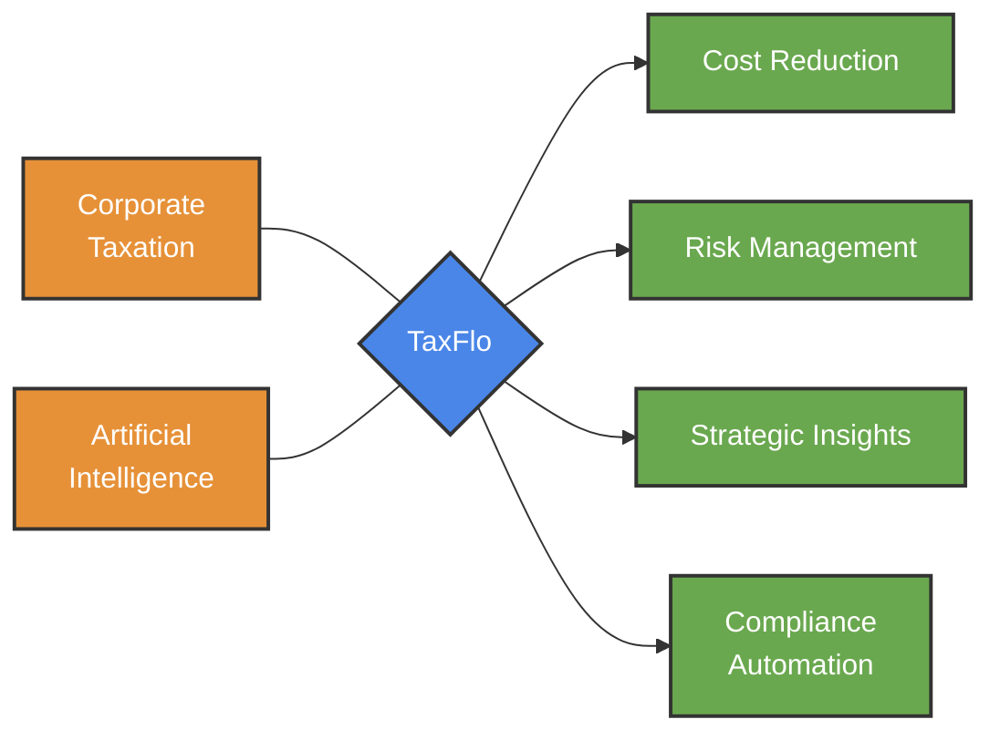

# 🤖 TaxFlo

### *AI-Powered Corporate Tax Consulting*

*Transforming corporate tax strategy through artificial intelligence*

---

## 🌟 Vision

TaxFlo aims to revolutionize corporate tax consulting by combining cutting-edge AI technology with deep tax expertise. We're building intelligent tax agents that automate compliance, optimize planning, and deliver strategic insights to corporate clients of all sizes.

> "In the complex world of corporate taxation, AI doesn't just bring efficiency—it unlocks strategic opportunities that would otherwise remain hidden."

## 📋 Business Plan Sections

<table>
  <tr>
    <td width="33%" align="center">
      <a href="./1_Market_Research/Market_Research.md">
         
        <b>📊 Market Research</b>
      </a>
      
Analysis of the $18.7B corporate tax market and emerging AI trends

    </td>
    <td width="33%" align="center">
      <a href="./2_Business_Analysis/Business_Analysis.md">
         
        <b>💼 Business Analysis</b>
      </a>
      
Business model canvas, SWOT analysis, and value proposition

    </td>
    <td width="33%" align="center">
      <a href="./3_Customer_Discovery/Customer_Discovery_Strategy.md">
         
        <b>🔍 Customer Discovery</b>
      </a>
      
Target segments, personas, and validation strategies

    </td>
  </tr>
  <tr>
    <td width="33%" align="center">
      <a href="./4_Implementation_Plan/Implementation_Plan.md">
         
        <b>🛠️ Implementation Plan</b>
      </a>
      
Roadmap, team structure, and phased approach over 34 months

    </td>
    <td width="33%" align="center">
      <a href="./5_System_Architecture/System_Architecture.md">
         
        <b>⚙️ System Architecture</b>
      </a>
      
Technical framework, AI components, and security architecture

    </td>
    <td width="33%" align="center">
      <a href="./6_Marketing_Plan/Marketing_Plan.md">
         
        <b>📣 Marketing Plan</b>
      </a>
      
Brand strategy, digital marketing, and growth metrics

    </td>
  </tr>
  <tr>
    <td width="33%" align="center" colspan="3">
      <a href="./7_Unified_Agents/Unified_Agents.md">
         
        <b>🧠 Unified Agents</b>
      </a>
      
Six specialized AI agents powering our tax consulting platform

    </td>
  </tr>
</table>

## 🚀 Executive Summary

TaxFlo is building an AI-powered corporate tax consulting platform that will transform how companies manage their tax functions. Our platform combines:

- **Cutting-edge AI technology** that can understand tax regulations, analyze documents, and provide strategic insights
- **Deep tax expertise** embedded into specialized AI agents for different tax functions
- **Modern cloud architecture** with enterprise-grade security and scalability
- **User-centered design** that makes complex tax concepts accessible

With the corporate tax services market valued at $18.72 billion in 2025 and AI in tax management growing to $2.44 billion, TaxFlo is positioned at the intersection of two massive growth opportunities.

## 💰 Revenue Model

Our multi-stream revenue model includes:

- **Subscription Services** (45%): Tiered access to our platform
- **Advisory Projects** (30%): AI-augmented consulting engagements
- **Implementation Fees** (15%): Technical integration and data migration
- **Custom AI Development** (10%): Specialized solutions for complex needs

## 📅 Next Steps

- [ ] Executive summary and investor pitch deck creation
- [ ] Financial modeling and projections
- [ ] MVP definition and development plan
- [ ] Customer validation interviews
- [ ] Technical talent recruitment
- [ ] Seed funding preparation

---

### Join Our Journey

[Website](#) • [Email](#) • [LinkedIn](#) • [Twitter](#)

